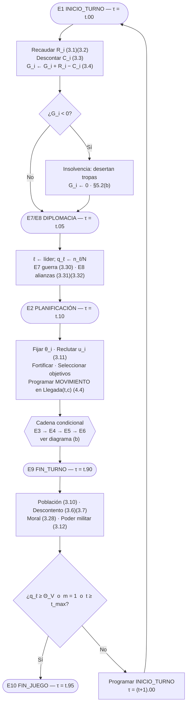
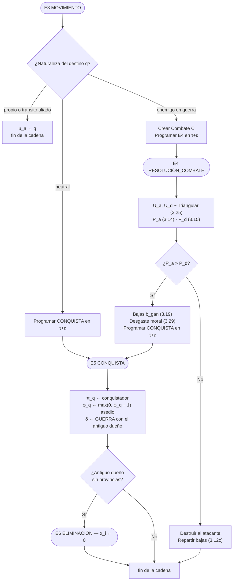
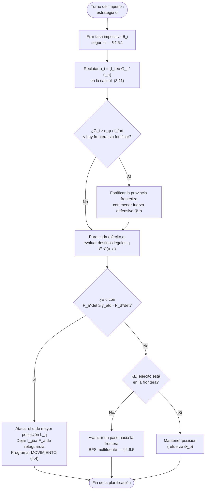

# 1. Introducción y alcance

## 1.1 Del modelo conceptual al modelo formal

El Parcial I estableció el **modelo conceptual** de *Age of Conquest*: identificó las
entidades del sistema (Imperio, Provincia, Mapa, Ejército, Combate, Negociación), sus
atributos, los diez eventos que gobiernan la dinámica (E1–E10), el grafo de
planificación entre ellos y la estructura de la Lista de Eventos Futuros. Estableció
además la hipótesis de comportamiento del sistema mediante un diagrama de bucles
causales con un bucle reforzador (R1, bola de nieve) y tres balanceadores (B1
sobreextensión, B2 atrición, B3 coalición anti-líder).

Aquel documento dejó, sin embargo, un algoritmo **abierto**. El pseudocódigo de los
eventos invoca trece funciones que nunca define —`calcularIngreso()`,
`Aleatorio()`, `Terreno(p, ATAQUE)`, `SeleccionarObjetivos()`, `RegenerarMoral()`,
entre otras— y nueve parámetros que nombra sin asignarles valor —`K_BAJAS`,
`UMBRAL_VICTORIA`, `ε`, `COSTO_UNIDAD`—. Un programador ajeno al equipo no podría
implementarlo: sabría *qué* se calcula en cada evento, pero no *cómo* ni *cuánto*.

El presente documento cierra ese modelo. Su propósito es triple:

1. **Definir matemáticamente** cada función y cada parámetro que el modelo conceptual
   dejó abierto, de modo que toda transición de estado quede determinada sin ambigüedad.
2. **Reparar las incoherencias** que se hacen visibles al intentar formalizar el
   modelo conceptual, documentando cada corrección y su motivo.
3. **Demostrar** que el conjunto resultante es cerrado, dimensionalmente consistente,
   temporalmente causal y terminante.

El criterio de suficiencia que se persigue es el enunciado en la actividad: *un
programador independiente, que nunca haya jugado a Age of Conquest, debe poder
codificar el sistema leyendo únicamente este documento*.

## 1.2 Paradigma de simulación adoptado

Se conserva el paradigma comprometido en el Parcial I: **simulación por eventos
discretos**. El estado del sistema permanece constante entre eventos y cambia
únicamente en instantes discretos, cuando un evento se ejecuta. El reloj no avanza
con paso fijo: **salta** al instante del próximo evento extraído de la LEF.

Esta elección no es cosmética. Un modelo de incremento fijo de tiempo —un bucle de
fases repetido turno a turno— sería suficiente si todos los efectos se resolvieran
dentro del turno en que se ordenan. No es el caso: un ejército que atraviesa una
cordillera tarda más de un turno en llegar, y su llegada debe quedar **programada en
el futuro** y resolverse en el instante correcto, con el estado del mapa que exista
entonces y no con el que existía al ordenar el movimiento. Esa es la justificación
formal de la LEF, y la sección 4.2 la demuestra construyendo explícitamente la
función de llegada.

## 1.3 Revisiones respecto al modelo conceptual

La formalización obligó a detectar y reparar siete defectos del modelo conceptual, y
a incorporar tres refinamientos. Todos se declaran aquí de forma explícita; ninguno
se introduce de forma silenciosa.

| ID | Defecto detectado en el Parcial I | Corrección adoptada | Sección |
|:--|:--|:--|:--|
| **D1** | `estadoDiplomatico` se declara, se inicializa y se actualiza, pero **nunca se consulta**: E3 decidía entre mover y combatir mirando solo el propietario de la provincia. Un imperio podía atacar a su aliado sin romper la alianza, y las alianzas no tenían ningún efecto mecánico. | Se añade la **guarda diplomática** a E3: un movimiento hacia provincia ajena solo es legal si $\delta_{ij}=\text{GUERRA}$; las provincias de un aliado admiten tránsito pero no ataque. | §3.7, §4.5 |
| **D2** | Los eventos **E7** (Declaración de Guerra) y **E8** (Alianza) figuran en la tabla de eventos y en el grafo de planificación, pero la sección de pseudocódigo salta de E6 a E9. El método `evaluarDiplomacia()` se declara sin algoritmo. | Se define $\mathcal{F}_{12}$ y se escribe el pseudocódigo completo de E7 y E8, con criterios, histéresis y fase propia en el reloj. | §3.7, §4.5 |
| **D3** | La aritmética del reloj podía **desordenar los eventos**. En E2 el instante de llegada era $t + 0.15 + c$; con $c > 0.75$ el movimiento quedaba programado *después* del `FIN_TURNO` de fase $0.90$, es decir, un ejército llegaba después de que el turno hubiera cerrado y verificado la victoria. | Se redefine la llegada como **función por partes** que reparte el coste en turnos completos más una fase válida, y se **demuestra** que el resultado cae siempre dentro de la ventana de movimiento. | §4.2 |
| **D4** | Llegadas simultáneas indefinidas: dos ejércitos de imperios distintos que alcanzan la misma provincia en el mismo instante generaban **dos combates independientes** sobre la misma guarnición; dos ejércitos aliados tenían orden de fusión indeterminado. | Se define una **clave de orden total** $(\tau,\text{prioridad},\text{secuencia})$ para la LEF y un **predicado de revalidación** por tipo de evento, que cancela los eventos cuyo sujeto ha dejado de ser válido. | §4.3 |
| **D5** | El diagrama causal promete cuatro bucles, pero el pseudocódigo solo materializa dos: **B1 (sobreextensión) y B3 (coalición anti-líder) no tenían ningún mecanismo**. | Se cierra **B1** con tres mecanismos acoplados (dispersión de guarniciones, mantenimiento territorial, decaimiento de la moral con la distancia a la capital) y **B3** con el criterio anti-líder de $\mathcal{F}_{12}$. | §3.8 |
| **D6** | La moral **se regenera pero nunca se pierde**: E9 llamaba a `RegenerarMoral()` y ningún evento la reducía, por lo que convergía a su techo y dejaba de discriminar entre ejércitos. | Se definen dos sumideros de moral: **desgaste de combate** (proporcional a las bajas sufridas) y **techo decreciente con la distancia a la capital**. | §3.6 |
| **D8** | **Doble contabilidad de la fuerza.** En E3, el ejército que llega a una provincia conserva su atributo `fuerza` y **además** lo suma a la `guarnicion` del destino, sin que ningún evento revierta la suma al partir. La misma fuerza quedaba contada dos veces, y `poderMilitarTotal` —definido como suma de ejércitos— dejaba de ser consistente con la defensa efectiva de las provincias. | Se separan los dos conceptos: la **guarnición** $g_p$ es fuerza estacionada permanente y el **ejército** es fuerza móvil persistente que *no* se disuelve al llegar. La defensa de una provincia es la suma de ambas, ec. (3.12b), y el poder militar (3.12) computa cada una exactamente una vez. | §3.3, §4.5 |
| **D7** | El modelo conceptual no especificaba **ninguna condición de frontera**: qué ocurre con oro negativo, fuerza que tiende a cero, moral nula, pérdida de la capital (`esCapital` existía pero E5 no lo trataba) o empate en la cuota de victoria. | Se añade la sección 5 completa: dominios, funciones por partes, casos degenerados y demostración de terminación. | §5 |

| ID | Refinamiento incorporado | Motivo |
|:--|:--|:--|
| **O1** | **Tasa impositiva** $\theta_i$ como variable de decisión del imperio. El modelo conceptual tenía ingreso pasivo, $f(\text{poblacion}, \text{fortif})$. | Convierte la economía en un subsistema con control, enriquece la estrategia ECONÓMICA, y alinea el modelo con la formulación del tesoro propuesta como referencia en el enunciado de esta evaluación. |
| **O2** | **Descontento provincial** $D_p$, con umbral fiscal $D^\ast$. | Da al bucle B1 su brazo económico, introduce una discontinuidad relevante para la sección 5 y acopla el subsistema económico con el militar mediante el factor de respaldo civil. |
| **O3** | Distribución **Triangular** para el factor aleatorio de combate, en lugar de un `Aleatorio()` sin especificar. | Es el estándar en simulación cuando solo se conocen mínimo, moda y máximo; admite generación por transformada inversa en forma cerrada; y penaliza los resultados extremos frente a la uniforme. |

Se conserva la estructura de **diez eventos** del Parcial I. Ningún refinamiento
añade eventos nuevos.

## 1.4 Convenciones de notación

**Índices y conjuntos.**

| Símbolo | Significado |
|:--|:--|
| $i, j, \ell$ | imperios |
| $p, q$ | provincias |
| $a$ | ejército |
| $t$ | número de turno, $t\in\mathbb{N}$ |
| $\tau$ | instante del reloj de simulación, $\tau\in\mathbb{R}_{\ge 0}$ |
| $\mathcal{I}$ | conjunto de imperios; $\mathcal{I}^{\text{act}}(\tau)\subseteq\mathcal{I}$ los activos |
| $\mathcal{P}$ | conjunto de provincias del mapa; $N=|\mathcal{P}|$ |
| $\mathcal{P}_i(\tau)$ | provincias controladas por el imperio $i$ |
| $\partial\mathcal{P}_i(\tau)$ | provincias **fronterizas** de $i$ |
| $\mathcal{A}_i(\tau)$ | ejércitos del imperio $i$ |
| $\mathcal{V}_p$ | provincias adyacentes a $p$ (constante) |

**Operadores.**

- $\mathbb{1}[\,\cdot\,]$ — función indicadora: vale $1$ si la condición se cumple, $0$ si no.
- $\lfloor x\rfloor,\ \lceil x\rceil$ — suelo y techo.
- $\operatorname{clamp}(x,a,b)=\min(\max(x,a),b)$.
- $x \bmod y$ — resto real no negativo.
- $d(p,q)$ — distancia geodésica en el grafo del mapa, en número de provincias.
- $X(\tau^-),\ X(\tau^+)$ — valor de la variable $X$ inmediatamente antes y después del evento que ocurre en $\tau$.

**Convenio temporal.** El reloj se expresa como $\tau = t + \varphi$, donde la parte
entera $t$ es el número de turno y la parte fraccionaria $\varphi \in [0,1)$ ordena
las fases internas. Un subíndice $t$ sin más denota el valor de la variable al
comienzo del turno $t$, esto es, en $\tau = t^-$.

---

# 2. Diccionario formal de variables y parámetros

Toda magnitud del modelo aparece en este capítulo. Las secciones 3, 4 y 5 no
introducen ningún símbolo que no esté declarado aquí.

## 2.1 Variables de estado

Definen la configuración del sistema. Persisten entre eventos y solo cambian cuando
un evento las modifica.

### 2.1.1 Imperio

| Símbolo | Atributo del Parcial I | Descripción | Unidad | Dominio | Se actualiza en |
|:--|:--|:--|:--|:--|:--|
| $G_i(\tau)$ | `oro` | Tesoro del imperio | oro | $\mathbb{R}_{\ge 0}$ | E1, E2, §5.2(a) |
| $\theta_i(\tau)$ | — *(nuevo, O1)* | Tasa impositiva vigente | % | $[0,\theta_{\max}]$ | E2 |
| $\sigma_i$ | `estrategiaIA` | Política de decisión | categórica | $\{\text{AGR},\text{DEF},\text{ECO},\text{EQU}\}$ | constante |
| $\mathcal{P}_i(\tau)$ | `listaProvincias` | Provincias controladas | conjunto | $\subseteq\mathcal{P}$ | E5 |
| $n_i(\tau)$ | `numProvincias` | Cardinal de $\mathcal{P}_i$ | provincias | $\mathbb{Z}_{\ge 0}$ | E5 |
| $\mathcal{A}_i(\tau)$ | `listaEjercitos` | Ejércitos del imperio | conjunto | — | E2, E4 |
| $M_i(\tau)$ | `poderMilitarTotal` | Fuerza militar agregada | unidades de fuerza | $\mathbb{R}_{\ge 0}$ | E9 |
| $\delta_{ij}(\tau)$ | `estadoDiplomatico` | Relación con el imperio $j$ | categórica | $\{\text{PAZ},\text{GUERRA},\text{ALIANZA}\}$ | E5, E7, E8 |
| $c_i(\tau)$ | *(implícito en* `esCapital`*)* | Provincia capital | id de provincia | $\mathcal{P}\cup\{\varnothing\}$ | E5, §5.3(c) |
| $\alpha_i(\tau)$ | `activo` | Imperio en juego | binaria | $\{0,1\}$ | E6 |

> **Nota sobre $\delta$.** La matriz diplomática es **simétrica** por construcción:
> $\delta_{ij}=\delta_{ji}$ para todo par, y $\delta_{ii}$ no está definida. Todo
> evento que la modifique debe actualizar ambas entradas.

### 2.1.2 Provincia

| Símbolo | Atributo del Parcial I | Descripción | Unidad | Dominio | Se actualiza en |
|:--|:--|:--|:--|:--|:--|
| $\pi_p(\tau)$ | `propietario` | Imperio dueño | id \| NEUTRAL | $\mathcal{I}\cup\{\varnothing\}$ | E5 |
| $L_p(\tau)$ | `poblacion` | Habitantes | habitantes | $[0,L_{\max}]$ | E9, E4 |
| $\phi_p(\tau)$ | `nivelFortificacion` | Nivel de fortificación | niveles | $\{0,1,\dots,\Phi_{\max}\}$ | E2, E5 |
| $g_p(\tau)$ | `guarnicion` | Fuerza estacionada | unidades de fuerza | $\mathbb{R}_{\ge 0}$ | E3, E4 |
| $D_p(\tau)$ | — *(nuevo, O2)* | Descontento de la población | puntos de descontento | $[0,100]$ | E9 |
| $T_p$ | `terreno` | Tipo de terreno | categórica | $\{\text{LLA},\text{BOS},\text{MON},\text{COS}\}$ | constante |
| $\mathcal{V}_p$ | `listaAdyacentes` | Provincias vecinas | conjunto | $\subseteq\mathcal{P}$ | constante |
| $\chi_p(\tau)$ | `enConflicto` | Hay combate activo | binaria | $\{0,1\}$ | E3, E4 |

El atributo `ingresoBase` del Parcial I **no es una variable de estado**: es una
variable de flujo derivada de $L_p$, $\theta_i$, $\phi_p$ y $D_p$. Se reclasifica en
§2.3. El atributo `esCapital` se sustituye por $c_i$, que hace explícito que la
capital es una propiedad del imperio y no de la provincia, y permite su
reasignación (§5.3c).

### 2.1.3 Ejército

| Símbolo | Atributo del Parcial I | Descripción | Unidad | Dominio | Se actualiza en |
|:--|:--|:--|:--|:--|:--|
| $F_a(\tau)$ | `fuerza` | Efectivos del ejército | unidades de fuerza | $\mathbb{R}_{\ge 0}$ | E2, E4 |
| $u_a(\tau)$ | `ubicacion` | Provincia donde se encuentra | id de provincia | $\mathcal{P}$ | E3 |
| $v_a$ | `puntosMovimiento` | Capacidad de desplazamiento | provincias/turno | $\mathbb{R}_{>0}$ | constante |
| $\mu_a(\tau)$ | `moral` | Multiplicador de eficacia | adimensional | $[\mu_{\min},1]$ | E4, E9 |
| $\omega_a(\tau)$ | `enCombate` | Estado de combate | binaria | $\{0,1\}$ | E3, E4 |
| $\pi_a$ | `propietario` | Imperio dueño | id de imperio | $\mathcal{I}$ | constante |

### 2.1.4 Combate (entidad temporal)

Se crea en E3 y se destruye al final de E4.

| Símbolo | Atributo del Parcial I | Descripción | Unidad |
|:--|:--|:--|:--|
| $p_C$ | `provincia` | Lugar del enfrentamiento | id de provincia |
| $a_C$ | `ejercitoAtacante` | Ejército invasor | id de ejército |
| $g_C$ | `ejercitoDefensor` | Guarnición defensora | unidades de fuerza |
| $\tau_C$ | `instanteInicio` | Instante de creación | tiempo de simulación |
| $r_C$ | `resultado` | Desenlace | $\{\text{ATACANTE},\text{DEFENSOR},\text{PENDIENTE}\}$ |

### 2.1.5 Estado del sistema

| Símbolo | Variable del Parcial I | Descripción | Unidad | Dominio |
|:--|:--|:--|:--|:--|
| $\tau$ | `relojSimulacion` | Reloj de simulación | tiempo de simulación | $\mathbb{R}_{\ge 0}$ |
| $t$ | `turnoActual` | Turno en curso | turnos | $\mathbb{N}$ |
| $\mathcal{L}(\tau)$ | `LEF` | Lista de eventos futuros | cola de prioridad | — |
| $m(\tau)$ | `imperiosActivos` | Imperios en juego | imperios | $\mathbb{Z}_{\ge 0}$ |
| $N$ | `totalProvincias` | Tamaño del mapa | provincias | $\mathbb{Z}_{>0}$ |
| $Z(\tau)$ | `finJuego` | Bandera de terminación | binaria | $\{0,1\}$ |
| $\nu(\tau)$ | `numCombates` | Combates acumulados | combates | $\mathbb{Z}_{\ge 0}$ |
| $\beta(\tau)$ | `bajasTotales` | Bajas acumuladas | unidades de fuerza | $\mathbb{R}_{\ge 0}$ |
| $\varsigma(\tau)$ | — *(nuevo, D4)* | Contador de secuencia de la LEF | adimensional | $\mathbb{Z}_{\ge 0}$ |

El vector de estado completo del sistema es

$$
S(\tau)=\Big(\big\{G_i,\theta_i,\mathcal{P}_i,\mathcal{A}_i,M_i,c_i,\alpha_i\big\}_{i\in\mathcal{I}},\ \{\delta_{ij}\},\ \big\{\pi_p,L_p,\phi_p,g_p,D_p,\chi_p\big\}_{p\in\mathcal{P}},\ \big\{F_a,u_a,\mu_a,\omega_a\big\}_{a},\ \mathcal{L},\,t,\,m,\,Z,\,\nu,\,\beta,\,\varsigma\Big).
$$

## 2.2 Variables auxiliares

Se calculan a demanda a partir del estado; no se almacenan.

| Símbolo | Definición | Descripción | Unidad |
|:--|:--|:--|:--|
| $q_i(\tau)$ | $n_i/N$ | Cuota territorial del imperio | adimensional $[0,1]$ |
| $\ell(\tau)$ | $\arg\max_i q_i$ | Imperio líder | id de imperio |
| $\partial\mathcal{P}_i$ | $\{p\in\mathcal{P}_i:\exists\, q\in\mathcal{V}_p,\ \pi_q\neq i\}$ | Provincias fronterizas | conjunto |
| $B_i(\tau)$ | $\lvert\partial\mathcal{P}_i\rvert$ | **Longitud de frontera** | provincias |
| $\bar g_i(\tau)$ | $\big(\sum_{p\in\partial\mathcal{P}_i} g_p\big)\big/B_i$ | **Dispersión de guarniciones** | fuerza/provincia |
| $P_a$ | ec. (3.14) | Potencia de combate del atacante | unidades de potencia |
| $P_d$ | ec. (3.15) | Potencia de combate del defensor | unidades de potencia |
| $\bar\mu_a(\tau)$ | ec. (3.27) | Techo de moral por proyección de fuerza | adimensional |
| $\theta^{\text{eq}}_i(\tau)$ | ec. (3.8) | Tasa impositiva de equilibrio | % |
| $c(a,p\!\to\!q)$ | ec. (3.13) | Coste de movimiento | turnos |
| $\mathcal{D}_p(\tau)$ | ec. (3.12b) | **Fuerza defensiva** de la provincia | unidades de fuerza |
| $\beta_p(t)$ | acumulador de E4 | Bajas causadas en la provincia $p$ durante el turno $t$; se consume y reinicia en E9 | unidades de fuerza |
| $\operatorname{Vul}_i(\tau)$ | ec. (3.34) | Vulnerabilidad defensiva del imperio | adimensional $(0,1)$ |
| $k$ | §3.4.2 | Cociente de potencias deterministas | adimensional |
| $B_i(\tau)$ | ec. (3.33) | Longitud de frontera | provincias |
| $\bar g_i(\tau)$ | ec. (3.33) | Dispersión de guarniciones | fuerza/provincia |
| $n^{\max}$ | ec. (3.9) | Tamaño máximo sostenible del imperio | provincias |

## 2.3 Variables de flujo

Tasas de cambio; su unidad lleva siempre *por turno*.

| Símbolo | Definición | Descripción | Unidad |
|:--|:--|:--|:--|
| $I_p(t)$ | ec. (3.1) | Renta fiscal de la provincia $p$ | oro/turno |
| $R_i(t)$ | ec. (3.2) | Recaudación total del imperio | oro/turno |
| $C_i(t)$ | ec. (3.3) | Coste de mantenimiento del imperio | oro/turno |
| $\Delta D_p(t)$ | ec. (3.6) | Variación del descontento | puntos/turno |
| $\Delta L_p(t)$ | ec. (3.10) | Variación de población | habitantes/turno |
| $\Delta\mu_a(t)$ | ec. (3.28) | Regeneración de moral | adimensional/turno |
| $b_{\text{gan}}$ | ec. (3.19) | Bajas del vencedor del combate | unidades de fuerza |
| $b_{\text{perd}}$ | ec. (3.20) | Bajas del perdedor del combate | unidades de fuerza |
| $X_i(t)$ | ec. (3.5) | Gasto discrecional del turno | oro/turno |
| $u_i(t)$ | ec. (3.11) | Unidades reclutadas | unidades/turno |

## 2.4 Parámetros fijos

Procedencia: `[D]` documentado del juego real · `[M]` decisión de modelado ·
`[C]` sujeto a calibración experimental en el Parcial III.

### 2.4.1 Escenario e inicialización

| Símbolo | Parámetro | Valor | Unidad | Proc. |
|:--|:--|:--:|:--|:--:|
| $N$ | Provincias del mapa | $24$ | provincias | [M] |
| $\lvert\mathcal{I}\rvert$ | Imperios iniciales | $4$ | imperios | [M] |
| $G^0$ | Tesoro inicial (`ORO_INICIAL`) | $200$ | oro | [M][C] |
| $F^0$ | Fuerza inicial (`FUERZA_INICIAL`) | $100$ | unidades de fuerza | [M][C] |
| $L^0_p$ | Población inicial | $[1000,\,10000]$ | habitantes | [M] |
| $D^0_p$ | Descontento inicial | $20$ | puntos | [M] |
| $\phi^0_p$ | Fortificación inicial | $0$; capital $1$ | niveles | [M] |
| $\mu^0_a$ | Moral inicial | $1.0$ | adimensional | [M] |
| $s_0$ | Semilla del generador | $20260805$ | — | [M] |

### 2.4.2 Subsistema económico

| Símbolo | Parámetro | Valor | Unidad | Proc. |
|:--|:--|:--:|:--|:--:|
| $\iota$ | Renta unitaria a tasa $100\%$ | $0.01$ | oro/(habitante·turno) | [M][C] |
| $\beta_\phi$ | Bonificación de renta por fortificación | $0.05$ | 1/nivel | [M] |
| $c_{\text{adm}}$ | Coste administrativo por provincia | $2.0$ | oro/(provincia·turno) | [M][C] |
| $c_{\text{up}}$ | Mantenimiento militar unitario | $0.05$ | oro/(unidad·turno) | [M][C] |
| $c_u$ | Coste de reclutamiento (`COSTO_UNIDAD`) | $1.5$ | oro/unidad | [M][C] |
| $c_\phi$ | Coste de un nivel de fortificación | $40$ | oro/nivel | [M] |
| $\theta_{\max}$ | Tasa impositiva máxima | $150$ | % | [M] |
| $\theta_0$ | Tasa fiscalmente neutra | $50$ | % | [M] |

### 2.4.3 Descontento

| Símbolo | Parámetro | Valor | Unidad | Proc. |
|:--|:--|:--:|:--|:--:|
| $\eta_\theta$ | Sensibilidad a la presión fiscal | $0.06$ | puntos/(turno·%) | [M][C] |
| $\eta_w$ | Descontento por estado de guerra | $2.0$ | puntos/turno | [M] |
| $\eta_n$ | Descontento por sobreextensión | $0.5$ | puntos/(turno·provincia) | [M][C] |
| $n^\ast$ | Umbral administrativo de provincias | $8$ | provincias | [M][C] |
| $\eta_r$ | Recuperación base | $1.5$ | puntos/turno | [M] |
| $D^\ast$ | Umbral fiscal de descontento | $60$ | puntos | [M][C] |
| $\psi$ | Penalización defensiva máxima por descontento | $0.4$ | adimensional | [M] |

### 2.4.4 Moral

| Símbolo | Parámetro | Valor | Unidad | Proc. |
|:--|:--|:--:|:--|:--:|
| $\mu_{\min}$ | Moral mínima | $0.40$ | adimensional | [M] |
| $\lambda_d$ | Decaimiento por distancia a la capital | $0.06$ | 1/provincia | [M][C] |
| $\rho_\mu$ | Regeneración de moral por turno | $0.10$ | 1/turno | [M] |
| $\gamma_\mu$ | Desgaste moral por bajas | $0.50$ | adimensional | [M] |

### 2.4.5 Combate

| Símbolo | Parámetro | Valor | Unidad | Proc. |
|:--|:--|:--:|:--|:--:|
| $K_B$ | Coeficiente de bajas (`K_BAJAS`) | $0.70$ | adimensional | [M][C] |
| $\beta_F$ | Bonificación defensiva por nivel de fortificación | $0.15$ | 1/nivel | [D][M] |
| $\Phi_{\max}$ | Nivel máximo de fortificación | $4$ | niveles | [M] |
| $F_{\min}$ | Fuerza mínima viable de un ejército | $5$ | unidades de fuerza | [M] |
| $g_{\text{ref}}$ | Guarnición de referencia (normaliza la vulnerabilidad) | $50$ | unidades de fuerza | [M] |
| $(a_U,c_U,b_U)$ | Parámetros del factor aleatorio | $(0.8,\,1.0,\,1.2)$ | adimensional | [M][C] |

### 2.4.6 Matriz de terreno $\mathcal{T}$

| Terreno | $\mathcal{T}(T_p,\text{ATQ})$ | $\mathcal{T}(T_p,\text{DEF})$ | $w(T_p)$ coste de cruce |
|:--|:--:|:--:|:--:|
| LLANURA | $1.00$ | $1.00$ | $1.0$ |
| BOSQUE | $0.90$ | $1.15$ | $1.4$ |
| MONTAÑA | $0.80$ | $1.30$ | $2.0$ |
| COSTA | $0.95$ | $1.10$ | $1.2$ |

Procedencia [M][C]. Los valores respetan el criterio cualitativo del Parcial I —el
terreno modifica combate *y* movimiento— y son simétricamente coherentes: el terreno
que más penaliza el ataque es el que más favorece la defensa y el que más cuesta
cruzar.

### 2.4.7 Reloj y Lista de Eventos Futuros

| Símbolo | Parámetro | Valor | Unidad | Proc. |
|:--|:--|:--:|:--|:--:|
| $\varphi_{\text{INI}}$ | Fase de INICIO_TURNO | $0.00$ | fracción de turno | [M] |
| $\varphi_{\text{DIP}}$ | Fase de la evaluación diplomática | $0.05$ | fracción de turno | [M] |
| $\varphi_{\text{PLA}}$ | Fase de PLANIFICACIÓN | $0.10$ | fracción de turno | [M] |
| $\varphi_{\text{MOV}}$ | Inicio de la ventana de movimiento | $0.15$ | fracción de turno | [M] |
| $\varphi_{\text{FIN}}$ | Fase de FIN_TURNO | $0.90$ | fracción de turno | [M] |
| $\varphi_{\text{JUE}}$ | Fase de FIN_JUEGO | $0.95$ | fracción de turno | [M] |
| $\varepsilon$ | Paso infinitesimal del reloj | $10^{-3}$ | fracción de turno | [M] |
| $\Delta$ | Anchura útil de la ventana de movimiento | $0.746$ | fracción de turno | derivado, ec. (4.3) |

### 2.4.8 Movimiento, población y terminación

| Símbolo | Parámetro | Valor | Unidad | Proc. |
|:--|:--|:--:|:--|:--:|
| $v_a$ | Puntos de movimiento base | $1.5$ | provincias/turno | [M][C] |
| $g_{\text{ret}}$ | Guarnición de reserva de la capital | $30$ | unidades de fuerza | [M] |
| $A_{\max}$ | Ejércitos simultáneos por imperio | $4$ | ejércitos | [M] |
| $g_L$ | Tasa de crecimiento poblacional | $0.01$ | 1/turno | [M][C] |
| $L_{\max}$ | Población máxima por provincia | $20\,000$ | habitantes | [M] |
| $\varrho$ | Habitantes destruidos por unidad de baja | $2$ | habitantes/unidad | [M] |
| $\Theta_V$ | Cuota de victoria (`UMBRAL_VICTORIA`) | $0.60$ | adimensional | [M][C] |
| $t_{\max}$ | Límite de turnos | $200$ | turnos | [M] |
| $\theta_{\text{am}}$ | Cuota que dispara la coalición anti-líder | $0.40$ | adimensional | [M][C] |
| $\varsigma_h$ | Histéresis de disolución de alianzas | $0.05$ | adimensional | [M] |

### 2.4.9 Parámetros de estrategia

Cada estrategia $\sigma\in\{\text{AGR},\text{DEF},\text{ECO},\text{EQU}\}$ es un
vector de parámetros. Es la definición de $\mathcal{F}_{11}$.

| Parámetro | Símbolo | AGRESIVA | DEFENSIVA | ECONÓMICA | EQUILIBRADA |
|:--|:--:|:--:|:--:|:--:|:--:|
| Tasa impositiva objetivo | $\theta^\sigma$ | $125$ | $100$ | $\theta^{\text{eq}}$ | $\tfrac12(100+\theta^{\text{eq}})$ |
| Fracción del tesoro a reclutar | $f_{\text{rec}}$ | $0.90$ | $0.60$ | $0.30$ | $0.70$ |
| Ventaja mínima para atacar | $\gamma_{\text{atq}}$ | $1.1$ | $1.8$ | $2.0$ | $1.4$ |
| Superioridad para declarar guerra | $\gamma_\sigma$ | $1.2$ | $2.5$ | $3.0$ | $1.8$ |
| Fracción de fuerza retenida en guarnición | $f_{\text{gua}}$ | $0.15$ | $0.50$ | $0.40$ | $0.30$ |
| Prioridad de fortificación | $f_{\text{fort}}$ | $0.05$ | $0.40$ | $0.25$ | $0.20$ |

## 2.5 Trazabilidad variable → objetivo del modelo

El Parcial I fijó cinco objetivos con sus métricas. Toda variable de estado existe
para servir al menos a uno; ninguna es decorativa.

| Objetivo | Métrica | Variables que la producen |
|:--|:--|:--|
| **O1** Duración media de la partida | turno final al disparar E10 | $t$, $Z$ |
| **O2** Balance entre estrategias de IA | tasa de victoria por estrategia | $\sigma_i$, $\alpha_i$, $q_i$ |
| **O3** Efecto bola de nieve | correlación provincias↔oro↔poder militar | $n_i$, $G_i$, $M_i$ |
| **O4** Intensidad bélica | combates por turno, bajas acumuladas | $\nu$, $\beta$ |
| **O5** Puntos de inflexión | primer turno con $q_\ell\ge 0.5$ | $q_i$, $\ell$ |

---

# 3. Modelo matemático

## 3.1 Ecuación de estado de un modelo de eventos discretos

En un modelo de eventos discretos el estado no evoluciona de forma continua ni con
paso fijo: permanece **constante entre eventos** y sufre un salto cuando un evento se
ejecuta. La ecuación de estado general del sistema es, por tanto, una familia de
aplicaciones de transición indexada por el tipo de evento:

$$
S(\tau^{+}) \;=\; \Psi_{e}\big(S(\tau^{-}),\ \Theta,\ \mathbf{U}\big),
\qquad
S(\tau) = S(\tau_k^{+}) \ \ \forall\, \tau\in[\tau_k,\tau_{k+1}),
\tag{3.0}
$$

donde $e$ es el evento extraído de la LEF en el instante $\tau_k$, $\Theta$ el vector
de parámetros fijos del capítulo 2 y $\mathbf{U}$ el vector de variables aleatorias
que el evento consume. La segunda igualdad es la **propiedad de constancia entre
eventos**, y es la que distingue formalmente este modelo de uno de incremento fijo de
tiempo.

De aquí se derivan dos familias de ecuaciones, que conviene no confundir:

- **Ecuaciones de diferencia por turno.** Los eventos E1 (Inicio de Turno) y E9 (Fin
  de Turno) son **periódicos**: ocurren exactamente una vez por turno. Las variables
  que solo ellos modifican admiten por tanto la forma clásica $X_{t+1}=f(X_t,\dots)$.
  Es el caso del tesoro, el descontento, la población, la moral y el poder militar.
- **Funciones de salto.** Los eventos E2–E8 y E10 son **condicionales**: ocurren solo
  si se dan ciertas circunstancias. Las variables que modifican no tienen una
  trayectoria por turno, sino una transición asociada al evento. Es el caso del
  propietario de una provincia, la fuerza de un ejército o la matriz diplomática.

---

## 3.2 Subsistema económico y demográfico

### 3.2.1 Renta provincial — definición de $\mathcal{F}_1$ (`calcularIngreso`)

El modelo conceptual dejaba `ingresoBase` como una $f(\text{poblacion},\text{fortif})$
sin especificar y sin control por parte del jugador. Se formaliza incorporando la
tasa impositiva $\theta_i$ como variable de decisión (refinamiento **O1**) y el
umbral de descontento como condición de cobro (refinamiento **O2**):

$$
\boxed{\;
I_p(t) \;=\; \iota\; L_p(t)\;\frac{\theta_{i}(t)}{100}\;\big(1+\beta_\phi\,\phi_p(t)\big)\;\mathbb{1}\big[\,D_p(t) < D^{\ast}\,\big],
\qquad i=\pi_p \;}
\tag{3.1}
$$

Cada factor tiene una lectura precisa:

- $\iota\,L_p$ es la **base imponible**: la riqueza que la provincia genera por turno,
  proporcional a su población. Con $\iota=0.01$, una provincia de $5000$ habitantes
  produce una base de $50$ oro/turno.
- $\theta_i/100$ es la **presión fiscal**. A tasa $100\%$ el imperio recauda la base
  íntegra; puede llegar hasta $\theta_{\max}=150\%$ a costa de descontento.
- $(1+\beta_\phi\phi_p)$ recoge que una provincia fortificada es una provincia segura,
  y por tanto comercialmente más productiva. Es la dependencia de `fortif` que el
  modelo conceptual anunciaba.
- El indicador es el **umbral fiscal**: una provincia cuyo descontento alcanza
  $D^{\ast}$ deja de tributar por completo. Es una discontinuidad deliberada, se
  analiza en §5.2(a).

Recaudación y coste agregados del imperio:

$$
R_i(t) \;=\; \sum_{p\in\mathcal{P}_i(t)} I_p(t)
\tag{3.2}
$$

$$
\boxed{\;C_i(t) \;=\; \underbrace{c_{\text{adm}}\,n_i(t)}_{\text{administración territorial}} \;+\; \underbrace{c_{\text{up}}\,M_i(t)}_{\text{mantenimiento militar}}\;}
\tag{3.3}
$$

El primer sumando de (3.3) es el brazo económico del bucle de sobreextensión **B1**:
cada provincia añadida cuesta $c_{\text{adm}}$ oro por turno con independencia de lo
que produzca.

### 3.2.2 Ecuación de estado del tesoro (evento E1)

$$
\boxed{\;
G_i(t+1) \;=\; \max\Big(0,\ G_i(t) \;+\; \underbrace{\sum_{p\in\mathcal{P}_i} \iota L_p \frac{\theta_i}{100}(1+\beta_\phi\phi_p)\,\mathbb{1}[D_p<D^{\ast}]}_{R_i(t)} \;-\; \underbrace{\big(c_{\text{adm}} n_i + c_{\text{up}} M_i\big)}_{C_i(t)} \;-\; X_i(t)\Big)\;}
\tag{3.4}
$$

donde $X_i(t)$ es el **gasto discrecional** ejecutado en E2:

$$
X_i(t) \;=\; c_u\,u_i(t) \;+\; c_\phi\,z_i(t),
\tag{3.5}
$$

con $u_i$ unidades reclutadas y $z_i$ niveles de fortificación adquiridos en ese
turno. El operador $\max(0,\cdot)$ implementa la regla de insolvencia; su
justificación y sus efectos colaterales se desarrollan en §5.2(b).

### 3.2.3 Descontento provincial (evento E9)

Refinamiento **O2**. El descontento es el mecanismo que impide que la recaudación
crezca indefinidamente con el territorio, y da a **B1** su brazo fiscal.

$$
\boxed{\;
\Delta D_p(t) \;=\; \underbrace{\eta_\theta\big(\theta_i(t)-\theta_0\big)}_{\text{presión fiscal}} \;+\; \underbrace{\eta_w\,\mathbb{1}\big[\exists j:\ \delta_{ij}=\text{GUERRA}\big]}_{\text{esfuerzo de guerra}} \;+\; \underbrace{\eta_n\max\big(0,\ n_i(t)-n^{\ast}\big)}_{\text{sobreextensión administrativa (B1)}} \;-\; \underbrace{\eta_r}_{\text{recuperación}}\;}
\tag{3.6}
$$

$$
D_p(t+1) \;=\; \operatorname{clamp}\big(D_p(t)+\Delta D_p(t),\ 0,\ 100\big)
\tag{3.7}
$$

### 3.2.4 Tasa impositiva de equilibrio y tamaño máximo sostenible

Imponiendo $\Delta D_p=0$ en (3.6) se obtiene la tasa que mantiene el descontento
estacionario, magnitud que la estrategia ECONÓMICA utiliza directamente como política
fiscal (§4.6.3):

$$
\boxed{\;
\theta^{\text{eq}}_i(t) \;=\; \theta_0 \;+\; \frac{\eta_r \;-\; \eta_w\,\mathbb{1}[\text{guerra}] \;-\; \eta_n\max\big(0,n_i-n^{\ast}\big)}{\eta_\theta}\;}
\tag{3.8}
$$

Con los valores del capítulo 2, un imperio pequeño y en paz tiene
$\theta^{\text{eq}} = 50 + 1.5/0.06 = 75\%$; el mismo imperio en guerra baja a
$\theta^{\text{eq}} = 50 + (1.5-2)/0.06 \approx 41.7\%$.

Como la tasa no puede ser negativa, la condición $\theta^{\text{eq}}_i\ge 0$ acota el
tamaño del imperio que es posible administrar sin descontento creciente:

$$
\boxed{\;
n^{\max} \;=\; n^{\ast} \;+\; \frac{\eta_r \;-\; \eta_w\,\mathbb{1}[\text{guerra}] \;+\; \eta_\theta\,\theta_0}{\eta_n}\;}
\tag{3.9}
$$

$$
n^{\max}_{\text{paz}} = 8+\frac{1.5+3}{0.5} = 17 \ \text{provincias},
\qquad
n^{\max}_{\text{guerra}} = 8+\frac{1.5-2+3}{0.5} = 13 \ \text{provincias}.
$$

> **Predicción del modelo.** La cuota de victoria exige
> $n \ge \lceil \Theta_V N\rceil = \lceil 0.60\cdot 24\rceil = 15$ provincias. Como
> $15 \le 17$ pero $15 > 13$, **un imperio en guerra permanente no puede alcanzar la
> condición de victoria sin que su descontento crezca sin freno**: la única vía es una
> campaña suficientemente rápida para conquistar antes de que $D_p$ alcance $D^\ast$,
> o una fase de paz consolidadora entre guerras. Este resultado no fue impuesto: se
> deduce de (3.6) y (3.9), y es exactamente el tipo de tensión que el bucle B1 del
> modelo conceptual anticipaba de forma cualitativa.

### 3.2.5 Dinámica de la población (evento E9)

El modelo conceptual declara `poblacion` como atributo pero no le asigna dinámica. Se
define crecimiento geométrico con saturación, más el daño de guerra:

$$
L_p(t+1) \;=\; \min\Big(L_{\max},\ L_p(t)\,\big(1+g_L\big)\Big) \;-\; \varrho\;\beta_p(t)
\tag{3.10}
$$

donde $\beta_p(t)$ son las bajas totales causadas en combates ocurridos en la
provincia $p$ durante el turno $t$. Este término acopla el subsistema militar con el
económico: la guerra destruye la base imponible del territorio que se disputa.

---

## 3.3 Subsistema militar y de movimiento

### 3.3.1 Reclutamiento — definición de $\mathcal{F}_2$ (`DecidirReclutamiento`)

Cada estrategia destina al reclutamiento una fracción $f_{\text{rec}}^{\sigma}$ de su
tesoro, en la capital:

$$
u_i(t) \;=\; \left\lfloor \frac{f_{\text{rec}}^{\sigma_i}\;G_i(t)}{c_u} \right\rfloor
\tag{3.11}
$$

### 3.3.2 Poder militar total — definición de $\mathcal{F}_{10}$

El modelo conceptual describe `poderMilitarTotal` como «suma de fuerzas de sus
ejércitos». Se precisa incluyendo las guarniciones, que también son fuerza sostenida
por el tesoro y por tanto deben computar en el mantenimiento (3.3):

$$
M_i(t) \;=\; \sum_{a\in\mathcal{A}_i} F_a(t) \;+\; \sum_{p\in\mathcal{P}_i} g_p(t)
\tag{3.12}
$$

**Fuerza defensiva de una provincia** (repara **D8**). Guarnición y ejército son
conceptos distintos y no intercambiables: la guarnición es fuerza estacionada
permanente, el ejército es fuerza móvil persistente que **no** se disuelve al llegar a
destino. Ambas defienden la provincia donde se encuentran, y cada una computa
exactamente una vez en (3.12):

$$
\boxed{\;\mathcal{D}_p(\tau) \;=\; g_p(\tau) \;+\; \sum_{a\,:\,u_a=p,\ \pi_a=\pi_p} F_a(\tau)\;}
\tag{3.12b}
$$

Si la defensa resulta vencida, la totalidad de $\mathcal{D}_p$ se destruye. Si vence,
las bajas $b_{\text{gan}}$ se reparten **proporcionalmente** entre la guarnición y cada
ejército estacionado:

$$
\Delta g_p = b_{\text{gan}}\,\frac{g_p}{\mathcal{D}_p},
\qquad
\Delta F_a = b_{\text{gan}}\,\frac{F_a}{\mathcal{D}_p}.
\tag{3.12c}
$$

### 3.3.3 Coste de movimiento — definición de $\mathcal{F}_4$ (`CosteMovimiento`)

El coste se expresa en **turnos** y depende del terreno que se atraviesa y de la
capacidad de desplazamiento del ejército:

$$
\boxed{\;c(a,\,p\!\to\! q) \;=\; \frac{w(T_q)}{v_a}\;}\qquad [\text{turnos}]
\tag{3.13}
$$

Con $v_a = 1.5$ provincias/turno y la matriz de terreno de §2.4.6:

| Destino | $w(T_q)$ | $c$ (turnos) | ¿Llega en el mismo turno? |
|:--|:--:|:--:|:--|
| LLANURA | $1.0$ | $0.667$ | Sí |
| COSTA | $1.2$ | $0.800$ | No — turno siguiente |
| BOSQUE | $1.4$ | $0.933$ | No — turno siguiente |
| MONTAÑA | $2.0$ | $1.333$ | No — turno siguiente |

Estos valores son los que justifican materialmente la existencia de la LEF: solo el
avance por llanura se resuelve dentro del turno en que se ordena; cualquier otro
desplazamiento debe programarse como evento futuro. La conversión de $c$ en un
instante del reloj se realiza mediante la función de llegada (4.4), que corrige el
defecto **D3**.

---

## 3.4 Modelo de resolución de combate

Es el subsistema con más funciones sin definir en el modelo conceptual: $P_a$ y $P_d$
se construían con cuatro factores de los cuales tres eran funciones abiertas
($\mathcal{F}_5$ moral, $\mathcal{F}_6$ terreno, $\mathcal{F}_8$ fortificación) y uno
una variable aleatoria sin distribución ($\mathcal{F}_7$).

### 3.4.1 Potencias de combate

$$
\boxed{\;P_a \;=\; F_a\;\cdot\;\mu_a\;\cdot\;\mathcal{T}(T_p,\text{ATQ})\;\cdot\;U_a\;}
\tag{3.14}
$$

$$
\boxed{\;P_d \;=\; \mathcal{D}_p\;\cdot\;\Phi(\phi_p)\;\cdot\;\mathcal{T}(T_p,\text{DEF})\;\cdot\;\Psi(D_p)\;\cdot\;U_d\;}
\tag{3.15}
$$

con $U_a, U_d$ independientes e idénticamente distribuidas según §3.5.

**Función de fortificación** — definición de $\mathcal{F}_8$:

$$
\Phi(\phi) \;=\; 1 + \beta_F\,\phi,
\qquad \phi\in\{0,1,\dots,\Phi_{\max}\},
\qquad \Phi\in[1.00,\,1.60]
\tag{3.16}
$$

Se adopta forma lineal: cada nivel añade un anillo defensivo de eficacia constante.
Una alternativa con rendimientos decrecientes, $\Phi(\phi)=1+\beta_F'\big(1-e^{-\phi}\big)$,
sería igualmente defendible; la lineal se prefiere por transparencia dimensional y
por facilitar la calibración de $\beta_F$ en el Parcial III.

**Función de respaldo civil** — refinamiento **O2**, contribuye al cierre de **B1**:

$$
\Psi(D_p) \;=\; 1 - \psi\,\frac{D_p}{100},
\qquad \Psi\in[1-\psi,\,1]=[0.60,\,1.00]
\tag{3.17}
$$

La guarnición no tiene moral propia en el modelo conceptual —no es un ejército, es un
valor de fuerza estacionada—. $\Psi$ desempeña para ella el papel que $\mu_a$
desempeña para el ejército invasor: una provincia descontenta defiende peor. El factor
acopla el subsistema económico con el militar y evita que $D_p$ sea una variable de
efecto puramente contable.

### 3.4.2 Criterio de victoria y régimen determinista

$$
\text{vence el atacante} \iff P_a > P_d
\qquad\text{(el empate exacto lo retiene el defensor)}
\tag{3.18}
$$

Sea $k$ el **cociente de potencias deterministas**, esto es, el cociente evaluado con
$U_a=U_d=\mathbb{E}[U]=1$:

$$
k \;=\; \frac{\mathcal{D}_p\,\Phi(\phi_p)\,\mathcal{T}(T_p,\text{DEF})\,\Psi(D_p)}{F_a\,\mu_a\,\mathcal{T}(T_p,\text{ATQ})}.
$$

Como $U_a,U_d\in[a_U,b_U]=[0.8,1.2]$, el cociente $U_a/U_d$ tiene soporte
$\left[\tfrac{a_U}{b_U},\tfrac{b_U}{a_U}\right]=\left[\tfrac23,\tfrac32\right]$. De
$P_a>P_d \iff U_a/U_d > k$ se sigue de inmediato:

> **Proposición 1 (regímenes del combate).**
> $$
> \Pr[\text{gana el atacante}] =
> \begin{cases}
> 1, & k \le \tfrac{2}{3} \quad\text{(superioridad } \ge 1.5\times\text{)}\\[2mm]
> \in(0,1), & \tfrac{2}{3} < k < \tfrac{3}{2}\\[2mm]
> 0, & k \ge \tfrac{3}{2} \quad\text{(inferioridad } \ge 1.5\times\text{)}
> \end{cases}
> $$
> Además, por simetría de la distribución triangular, $k=1 \Rightarrow \Pr=\tfrac12$.

Este resultado es la base cuantitativa de la diferenciación entre estrategias de IA:
los umbrales $\gamma_{\text{atq}}$ de §2.4.9 determinan si un imperio ataca solo en el
**régimen determinista** ($\gamma_{\text{atq}}\ge 1.5$: DEFENSIVA con $1.8$, ECONÓMICA
con $2.0$) o si acepta operar en el **régimen estocástico** aceptando riesgo
(AGRESIVA con $1.1$, EQUILIBRADA con $1.4$). Las cuatro estrategias del modelo
conceptual dejan así de ser etiquetas y adquieren un significado formal.

### 3.4.3 Bajas y supervivientes

Se conserva la forma propuesta en el Parcial I:

$$
\boxed{\;b_{\text{gan}} \;=\; F_{\text{gan}}\;\frac{P_{\text{perd}}}{P_{\text{gan}}}\;K_B\;}
\tag{3.19}
$$

$$
b_{\text{perd}} \;=\; F_{\text{perd}}
\qquad\text{(el bando derrotado se destruye por completo)}
\tag{3.20}
$$

$$
F_{\text{gan}}(\tau^{+}) \;=\; F_{\text{gan}}(\tau^{-})\left(1 - K_B\,\frac{P_{\text{perd}}}{P_{\text{gan}}}\right)
\tag{3.21}
$$

Como en el bando vencedor $P_{\text{perd}}/P_{\text{gan}}<1$ por (3.18) y
$K_B=0.70<1$, se cumple $F_{\text{gan}}(\tau^{+}) > 0.30\,F_{\text{gan}}(\tau^{-})$:
la fórmula nunca aniquila al vencedor. El caso $F_{\text{gan}}(\tau^{+})<F_{\min}$ se
trata en §5.3(b).

### 3.4.4 Relación con las ecuaciones de Lanchester

El enunciado de esta evaluación pide explícitamente situar el modelo de combate
respecto a las ecuaciones de Lanchester. La correspondencia resulta ser exacta, y no
con la ley cuadrática sino con la **ley lineal**.

Escríbase $P_a = F_a\,m_a$ y $P_d = \mathcal{D}_p\,m_d$, donde $m_a=\mu_a\mathcal{T}(T_p,\text{ATQ})U_a$
y $m_d=\Phi\,\mathcal{T}(T_p,\text{DEF})\Psi\,U_d$ agrupan los modificadores. Entonces
(3.19) se reescribe:

$$
b_{\text{gan}} \;=\; F_a\,\frac{\mathcal{D}_p\,m_d}{F_a\,m_a}\,K_B \;=\; K_B\,\frac{m_d}{m_a}\;\mathcal{D}_p .
\tag{3.22}
$$

Es decir: **las bajas del vencedor son proporcionales a la fuerza inicial del
perdedor, e independientes de la fuerza propia.** Esa es precisamente la firma de la
ley lineal de Lanchester.

> **Proposición 2 (equivalencia con la ley lineal de Lanchester).**
> Sea un combate descrito por la ley lineal de Lanchester, con coeficientes de
> eficacia $\alpha$ (atacante) y $\beta$ (defensor):
> $$
> \frac{dA}{dt} = -\beta\,A\,D, \qquad \frac{dD}{dt} = -\alpha\,A\,D .
> $$
> Si el atacante vence, sus supervivientes son $A_f = A_0 - \frac{\beta}{\alpha}D_0$.
>
> *Demostración.* Dividiendo ambas ecuaciones, $\dfrac{dA}{dD} = \dfrac{\beta}{\alpha}$,
> constante. Integrando desde $(A_0,D_0)$ hasta $(A_f,0)$:
> $A_f-A_0=\frac{\beta}{\alpha}(0-D_0)$. $\blacksquare$
>
> **Corolario.** Identificando $A_0=F_a$, $D_0=\mathcal{D}_p$, $\alpha=m_a$, $\beta=m_d$, el
> criterio de victoria de la EDO ($\alpha A_0 > \beta D_0$) coincide exactamente con
> (3.18) ($P_a>P_d$), y su solución cerrada coincide con (3.21) salvo el factor
> $K_B$. El modelo del Parcial I es, por tanto, **la solución analítica exacta de la
> ley lineal de Lanchester atenuada por el coeficiente $K_B$**, resuelta en un único
> evento.

Dos consecuencias que conviene explicitar:

1. **La resolución en un solo evento no es una aproximación.** Puesto que (3.21) es la
   solución cerrada de la EDO, resolver la batalla instantáneamente da el mismo
   resultado que integrarla en el tiempo. La discretización es exacta, lo que legitima
   el supuesto del Parcial I de que «el combate se resuelve de forma instantánea».
2. **La ley lineal es la apropiada para este sistema.** Lanchester dedujo la ley
   cuadrática para el fuego dirigido moderno, donde la superioridad numérica se
   multiplica, y la **ley lineal para el combate antiguo**, donde solo las unidades en
   contacto con la línea de frente combaten y la superioridad numérica no rinde
   ventajas cuadráticas. *Age of Conquest* es un sistema de guerra premoderna: la ley
   lineal es la elección correcta, y adoptarla es una decisión de modelado, no una
   simplificación.
3. **Interpretación de $K_B$.** Con $K_B=1$ se recupera la ley lineal pura. Con
   $K_B<1$ el vencedor sufre menos bajas de las que predice la ley: modela que una
   batalla es un enfrentamiento único que el perdedor abandona en desbandada antes de
   la aniquilación mutua, no una guerra de exterminio. $K_B$ es por ello el parámetro
   que gobierna el bucle de atrición **B2** y, con él, la duración de las partidas.

---

## 3.5 Generación de variables aleatorias

Definición de $\mathcal{F}_7$ (`Aleatorio()`), la única fuente de aleatoriedad del
modelo. El modelo conceptual la invocaba dos veces por combate sin especificar
distribución alguna.

### 3.5.1 Distribución adoptada

$$
U \;\sim\; \operatorname{Triangular}(a_U,\,c_U,\,b_U) \;=\; \operatorname{Triangular}(0.8,\ 1.0,\ 1.2)
$$

Es la distribución estándar en simulación cuando de una magnitud solo se conocen su
mínimo plausible, su valor más probable y su máximo plausible, que es exactamente la
información disponible aquí: la incertidumbre táctica de una batalla puede alterar el
resultado en torno a un $\pm 20\%$, siendo lo más probable que no lo altere. Frente a
la uniforme, penaliza los resultados extremos; frente a la normal truncada, admite
transformada inversa en forma cerrada y no requiere aceptación-rechazo.

**Función de densidad.** Con $a_U=0.8$, $c_U=1.0$, $b_U=1.2$ la distribución es
simétrica:

$$
f_U(x)=
\begin{cases}
\dfrac{2(x-a_U)}{(b_U-a_U)(c_U-a_U)} = 25\,(x-0.8), & 0.8\le x\le 1.0\\[3mm]
\dfrac{2(b_U-x)}{(b_U-a_U)(b_U-c_U)} = 25\,(1.2-x), & 1.0 < x\le 1.2\\[3mm]
0 & \text{en otro caso}
\end{cases}
\tag{3.23}
$$

**Función de distribución acumulada.**

$$
F_U(x)=
\begin{cases}
0, & x<0.8\\[2mm]
\dfrac{(x-0.8)^2}{0.08}, & 0.8\le x\le 1.0\\[3mm]
1-\dfrac{(1.2-x)^2}{0.08}, & 1.0<x\le 1.2\\[3mm]
1, & x>1.2
\end{cases}
\tag{3.24}
$$

**Momentos.**

$$
\mathbb{E}[U]=\frac{a_U+b_U+c_U}{3}=1.0,
\qquad
\operatorname{Var}[U]=\frac{a_U^2+b_U^2+c_U^2-a_Ub_U-a_Uc_U-b_Uc_U}{18}=\frac{0.12}{18}=0.00\overline{6},
$$

$$
\sigma_U = 0.0816,\qquad \text{CV}=8.16\,\%.
$$

Que $\mathbb{E}[U]=1$ es una propiedad deseada y no casual: garantiza que el factor
aleatorio **no sesga** la potencia media de ningún bando, de modo que las potencias
deterministas de §3.4.2 son efectivamente las esperadas.

### 3.5.2 Generación por transformada inversa

Como $F_U$ es continua y estrictamente creciente en $[0.8,1.2]$, admite inversa
explícita. Con $F_U(c_U)=(c_U-a_U)/(b_U-a_U)=0.5$:

$$
\boxed{\;
U = F_U^{-1}(R)=
\begin{cases}
a_U+\sqrt{R\,(b_U-a_U)(c_U-a_U)} \;=\; 0.8+\sqrt{0.08\,R}, & R < 0.5\\[3mm]
b_U-\sqrt{(1-R)(b_U-a_U)(b_U-c_U)} \;=\; 1.2-\sqrt{0.08\,(1-R)}, & R \ge 0.5
\end{cases}\;}
\tag{3.25}
$$

con $R\sim\operatorname{Uniforme}(0,1)$. La expresión es continua en $R=0.5$
(ambas ramas dan $1.0$) y cubre el soporte completo: $F_U^{-1}(0)=0.8$,
$F_U^{-1}(1)=1.2$.

### 3.5.3 Generador uniforme subyacente

$R$ se obtiene de un **generador congruencial lineal** (LCG) de 48 bits:

$$
X_{k+1} = \big(\mathsf{a}\,X_k + \mathsf{c}\big) \bmod \mathsf{m},
\qquad
R_k = \frac{X_{k+1}}{\mathsf{m}},
\tag{3.26}
$$

$$
\mathsf{a}=25\,214\,903\,917,\qquad \mathsf{c}=11,\qquad \mathsf{m}=2^{48},
\qquad X_0 = s_0 = 20\,260\,805 .
$$

Estos multiplicador y módulo satisfacen las condiciones de Hull–Dobell, por lo que el
generador tiene **periodo completo** $\mathsf{m}=2^{48}\approx 2.81\times 10^{14}$.

**Suficiencia del periodo.** Cada resolución de combate consume exactamente dos
números ($U_a$ y $U_d$). Una partida típica registra del orden de $10^2$ combates, y
un experimento de $10^4$ réplicas consume por tanto $\sim 2\times 10^6$ números:
ocho órdenes de magnitud por debajo del periodo. No hay riesgo de reciclado.

**Reproducibilidad y diseño de experimentos.** Fijar $s_0$ hace que una partida sea
**exactamente reproducible**, requisito para depurar el modelo y para verificar
resultados. Para el Parcial III se recomienda además la técnica de **números
aleatorios comunes** (semillas apareadas): al comparar dos configuraciones —por
ejemplo dos valores de $K_B$, o dos estrategias— se ejecuta la réplica $r$ de ambas
con la misma semilla $s_r$, de modo que las diferencias observadas no se deban a la
suerte del sorteo sino a la configuración. Es una técnica de reducción de varianza
que disminuye el número de réplicas necesario para alcanzar una precisión dada.

---

## 3.6 Dinámica de la moral

Repara el defecto **D6**: el modelo conceptual regeneraba la moral en E9 pero ningún
evento la reducía, por lo que convergía al techo y dejaba de discriminar.

### 3.6.1 Techo por proyección de fuerza — definición de $\mathcal{F}_5$

La moral alcanzable por un ejército decrece con su distancia a la capital: es el
brazo militar del bucle de sobreextensión **B1**.

$$
\boxed{\;\bar\mu_a(\tau) \;=\; \max\Big(\mu_{\min},\ 1-\lambda_d\;d\big(u_a(\tau),\,c_{\pi_a}(\tau)\big)\Big)\;}
\tag{3.27}
$$

donde $d(\cdot,\cdot)$ es la distancia geodésica en el grafo del mapa. Con
$\lambda_d=0.06$ y $\mu_{\min}=0.40$, el techo alcanza su mínimo a
$d_{\max}=(1-\mu_{\min})/\lambda_d = 10$ provincias: más allá de diez provincias de
su capital, un ejército opera al $40\%$ de eficacia.

### 3.6.2 Regeneración (evento E9)

$$
\mu_a(t+1) \;=\; \min\big(\bar\mu_a(t),\ \mu_a(t)+\rho_\mu\big)
\tag{3.28}
$$

Nótese que si el ejército se ha alejado de su capital, $\bar\mu_a$ puede haber caído
por debajo de $\mu_a$: en tal caso (3.28) **reduce** la moral hasta el nuevo techo.
La regeneración y la penalización por distancia son así el mismo mecanismo.

### 3.6.3 Desgaste de combate (evento E4)

El ejército vencedor pierde moral en proporción a las bajas sufridas:

$$
\mu_a(\tau^{+}) \;=\; \max\left(\mu_{\min},\ \mu_a(\tau^{-})\left(1-\gamma_\mu\,\frac{b_{\text{gan}}}{F_a(\tau^{-})}\right)\right)
\tag{3.29}
$$

Sustituyendo (3.19), el desgaste resulta ser
$\gamma_\mu K_B\,P_{\text{perd}}/P_{\text{gan}}$: una victoria ajustada cuesta moral,
una victoria holgada casi no. El ejército que encadena combates difíciles se degrada,
lo que introduce un límite natural a las campañas relámpago y refuerza **B2**.

---

## 3.7 Subsistema diplomático

Definición de $\mathcal{F}_{12}$ (`evaluarDiplomacia`), y reparación de los defectos
**D1** y **D2**. La evaluación se ejecuta en la fase $\varphi_{\text{DIP}}=0.05$, es
decir **antes** de la planificación ($0.10$), de modo que la estrategia de cada
imperio decide conociendo ya el estado diplomático del turno.

### 3.7.1 Guarda diplomática de los movimientos (repara D1)

El defecto central del modelo conceptual era que $\delta_{ij}$ no se consultaba nunca.
Se establece que un movimiento del imperio $i$ hacia la provincia $q$ es **legal** si
y solo si:

$$
\text{Legal}(i,q) \iff
\pi_q = i
\ \ \vee\ \ \pi_q = \varnothing
\ \ \vee\ \ \delta_{i,\pi_q}=\text{GUERRA}
\ \ \vee\ \ \big(\delta_{i,\pi_q}=\text{ALIANZA} \wedge \text{tránsito}\big)
$$

Un movimiento hacia territorio de un imperio con el que se está en PAZ es ilegal y se
rechaza en E2; hacia territorio de un ALIADO se permite el tránsito pero **no genera
combate** (la provincia no cambia de dueño). La alianza adquiere así efecto mecánico.

### 3.7.2 Declaración de guerra (evento E7)

$$
\boxed{\;
\text{E7}(i\to j) \iff \delta_{ij}=\text{PAZ} \ \wedge\ \Big[\ \underbrace{q_\ell \ge \theta_{\text{am}} \wedge j=\ell \wedge i\ne\ell}_{\text{(B3) coalición anti-líder}} \ \ \vee\ \ \underbrace{\frac{M_i}{\max(M_j,1)} \ge \gamma_\sigma^{\sigma_i} \wedge \operatorname{Adj}(i,j)}_{\text{oportunismo}}\ \Big]\;}
\tag{3.30}
$$

donde $\operatorname{Adj}(i,j)\iff \exists\,p\in\mathcal{P}_i,\ q\in\mathcal{P}_j: q\in\mathcal{V}_p$.

La primera cláusula es el mecanismo que cierra **B3**: en cuanto el líder supera la
cuota de amenaza $\theta_{\text{am}}=0.40$, todos los demás imperios activos le
declaran la guerra. La segunda es la agresión oportunista, calibrada por estrategia:
AGRESIVA ataca con solo un $20\%$ de superioridad, ECONÓMICA exige el triple de
fuerza.

### 3.7.3 Alianzas y ruptura (evento E8)

**Formación.** Dos imperios que comparten enemigo se alían:

$$
\text{E8}^{+}(i,j) \iff \delta_{ij}=\text{PAZ} \ \wedge\ \delta_{i\ell}=\delta_{j\ell}=\text{GUERRA} \ \wedge\ i,j\ne\ell \ \wedge\ q_\ell\ge\theta_{\text{am}}
\tag{3.31}
$$

**Ruptura con histéresis.** La alianza se disuelve cuando el líder deja de ser una
amenaza, pero con un margen $\varsigma_h$ que impide la oscilación:

$$
\text{E8}^{-}(i,j) \iff \delta_{ij}=\text{ALIANZA} \ \wedge\ q_\ell < \theta_{\text{am}} - \varsigma_h
\tag{3.32}
$$

La histéresis es necesaria: sin ella, un líder cuya cuota oscilase alrededor de
$\theta_{\text{am}}$ provocaría formación y disolución de alianzas en turnos
alternos, un artefacto del modelo sin correlato en el sistema real.

> **Restricción de consistencia.** No es posible declarar la guerra a un aliado
> mediante (3.30), pues exige $\delta_{ij}=\text{PAZ}$. La única salida de una alianza
> es (3.32). Es una decisión de modelado deliberada: mientras el líder siga siendo una
> amenaza, la coalición se mantiene cohesionada.

---

## 3.8 Cierre de los bucles causales

El modelo conceptual postuló cuatro bucles. Esta sección demuestra que los cuatro
están ahora materializados por ecuaciones, reparando el defecto **D5**.

### R1 — Bola de nieve económico-militar *(reforzador)*

$$
n_i \uparrow \;\xrightarrow{(3.2)}\; R_i \uparrow \;\xrightarrow{(3.4)}\; G_i \uparrow \;\xrightarrow{(3.11)}\; u_i \uparrow \;\xrightarrow{(3.12)}\; M_i \uparrow \;\xrightarrow{(3.14)}\; P_a \uparrow \;\xrightarrow{\text{E5}}\; n_i \uparrow
$$

Ya estaba implícito en el pseudocódigo del Parcial I; ahora es explícito y cuantificable.

### B2 — Atrición militar *(balanceador)*

$$
\text{combates} \uparrow \;\xrightarrow{(3.19)}\; b_{\text{gan}} \uparrow \;\xrightarrow{(3.12)}\; M_i \downarrow
\qquad\text{y}\qquad
\text{combates}\uparrow \;\xrightarrow{(3.29)}\; \mu_a \downarrow \;\xrightarrow{(3.14)}\; P_a\downarrow
$$

Gobernado por $K_B$ y $\gamma_\mu$.

### B1 — Sobreextensión *(balanceador)* — **nuevo**

El modelo conceptual lo describía —«más provincias → fronteras más largas →
guarniciones dispersas → vulnerabilidad → pérdida de provincias»— pero no lo
implementaba. Se cierra con cuatro mecanismos acoplados:

**B1a — Dispersión de guarniciones (el brazo literal del diagrama).**
Definiendo la longitud de frontera y la dispersión:

$$
B_i = \big|\partial\mathcal{P}_i\big|,
\qquad
\bar g_i = \frac{1}{B_i}\sum_{p\in\partial\mathcal{P}_i} g_p
\tag{3.33}
$$

A fuerza militar constante, expandirse aumenta $B_i$ y por tanto **reduce
$\bar g_i$**. Como $P_d$ en (3.15) es proporcional a $g_p$, la potencia defensiva
media de cada frontera cae, y con ella la probabilidad de retener cada provincia
según la Proposición 1. La vulnerabilidad puede medirse como

$$
\operatorname{Vul}_i \;=\; 1-\frac{\bar g_i}{\bar g_i + g_{\text{ref}}} \;\in\;(0,1)
\tag{3.34}
$$

**B1b — Coste territorial.** Vía $c_{\text{adm}}n_i$ en (3.3): cada provincia añadida
drena tesoro con independencia de su renta, reduciendo el reclutamiento (3.11).

**B1c — Proyección de fuerza.** Vía (3.27): cuanto más lejos de su capital opera un
ejército, menor es su techo de moral y por tanto su potencia ofensiva (3.14).

**B1d — Sobreextensión administrativa.** Vía el término $\eta_n\max(0,n_i-n^\ast)$ de
(3.6): superado $n^\ast$, el descontento crece en **todas** las provincias, hasta que
alcanzan $D^\ast$ y dejan de tributar (3.1).

El resultado agregado de los cuatro brazos es la cota $n^{\max}$ de la ecuación (3.9),
que es la formulación cuantitativa de lo que el Parcial I llamaba «frena el
crecimiento descontrolado».

### B3 — Coalición anti-líder *(balanceador)* — **nuevo**

$$
n_\ell \uparrow \;\Rightarrow\; q_\ell \uparrow \;\xrightarrow{q_\ell\ge\theta_{\text{am}}}\; \text{E7 de todos contra }\ell \;\xrightarrow{(3.31)}\; \text{alianzas} \;\Rightarrow\; \text{presión militar sobre }\ell \;\Rightarrow\; n_\ell \downarrow
$$

Con $\theta_{\text{am}}=0.40$ y $\Theta_V=0.60$, la coalición se activa **antes** de
que el líder alcance la victoria: existe una ventana $q_\ell\in[0.40,0.60)$ en la que
el líder debe conquistar el $20\%$ restante del mapa mientras todos los demás
imperios están en guerra contra él. Esa ventana es el «punto de inflexión» que el
objetivo **O5** del Parcial I se propone medir.

### Comportamiento emergente esperado

De la interacción de los cuatro bucles se predicen tres fases:

| Fase | Turnos | Bucle dominante | Comportamiento |
|:--|:--|:--|:--|
| Expansión | temprana | R1 | Crecimiento acelerado sobre provincias neutrales; poco combate |
| Fricción | media | B1, B2 | El crecimiento se frena al superar $n^\ast$; el descontento erosiona la renta; las campañas se alargan |
| Contención | tardía | B3 | Al cruzar $q_\ell=0.40$ se forma la coalición; la partida se decide en esa ventana |

---

## 3.9 Verificación del balance dimensional

Se comprueba que ninguna ecuación suma magnitudes de unidades distintas.

| Ec. | Miembro izquierdo | Miembro derecho | Verificación |
|:--|:--|:--|:--:|
| (3.1) | $[\text{oro}/\text{turno}]$ | $\frac{\text{oro}}{\text{hab}\cdot\text{turno}}\cdot\text{hab}\cdot[1]\cdot[1]\cdot[1]$ | ✔ |
| (3.3) | $[\text{oro}/\text{turno}]$ | $\frac{\text{oro}}{\text{prov}\cdot\text{turno}}\cdot\text{prov} \;+\; \frac{\text{oro}}{\text{ud}\cdot\text{turno}}\cdot\text{ud}$ | ✔ |
| (3.4) | $[\text{oro}]$ | $\text{oro} + \frac{\text{oro}}{\text{turno}}\cdot\text{turno} - \frac{\text{oro}}{\text{turno}}\cdot\text{turno} - \text{oro}$ | ✔ |
| (3.5) | $[\text{oro}]$ | $\frac{\text{oro}}{\text{ud}}\cdot\text{ud} + \frac{\text{oro}}{\text{nivel}}\cdot\text{nivel}$ | ✔ |
| (3.6) | $[\text{pto}/\text{turno}]$ | $\frac{\text{pto}}{\text{turno}\cdot\%}\cdot\% \;+\; \frac{\text{pto}}{\text{turno}} \;+\; \frac{\text{pto}}{\text{turno}\cdot\text{prov}}\cdot\text{prov} \;-\; \frac{\text{pto}}{\text{turno}}$ | ✔ |
| (3.8) | $[\%]$ | $\% + \dfrac{\text{pto}/\text{turno}}{\text{pto}/(\text{turno}\cdot\%)}$ | ✔ |
| (3.9) | $[\text{prov}]$ | $\text{prov} + \dfrac{\text{pto}/\text{turno}}{\text{pto}/(\text{turno}\cdot\text{prov})}$ | ✔ |
| (3.10) | $[\text{hab}]$ | $\text{hab}\cdot[1] \;-\; \frac{\text{hab}}{\text{ud}}\cdot\text{ud}$ | ✔ |
| (3.11) | $[\text{ud}]$ | $\dfrac{[1]\cdot\text{oro}}{\text{oro}/\text{ud}}$ | ✔ |
| (3.13) | $[\text{turnos}]$ | $\dfrac{[1]}{\text{prov}/\text{turno}}\cdot$ *(1 provincia recorrida)* | ✔ |
| (3.14) | $[\text{potencia}]$ | $\text{ud}\cdot[1]\cdot[1]\cdot[1]$ | ✔ |
| (3.15) | $[\text{potencia}]$ | $\text{ud}\cdot[1]\cdot[1]\cdot[1]\cdot[1]$ | ✔ |
| (3.19) | $[\text{ud}]$ | $\text{ud}\cdot\dfrac{\text{potencia}}{\text{potencia}}\cdot[1]$ | ✔ |
| (3.26) | $[1]$ | $\dfrac{[1]}{[1]}$ | ✔ |
| (3.27) | $[1]$ | $[1] - \frac{1}{\text{prov}}\cdot\text{prov}$ | ✔ |
| (3.29) | $[1]$ | $[1]\cdot\Big([1]-[1]\cdot\frac{\text{ud}}{\text{ud}}\Big)$ | ✔ |

**Observaciones.**

- La «unidad de potencia» de (3.14)–(3.15) es una magnitud derivada, no fundamental:
  potencia $=$ unidades de fuerza $\times$ modificadores adimensionales. Solo se
  compara consigo misma —en (3.18) mediante una desigualdad y en (3.19) mediante un
  cociente—, nunca se suma a otra magnitud, por lo que su elección de escala es
  irrelevante. Es la razón por la que los modificadores $\mu$, $\mathcal{T}$, $\Phi$,
  $\Psi$ y $U$ deben ser **todos adimensionales**, como en efecto lo son.
- $\theta$ se mide en $\%$ y se divide por $100$ en (3.1) para adimensionalizarla; en
  (3.6) y (3.8) se opera con $\theta$ en unidades de $\%$, de ahí que $\eta_\theta$
  lleve $\%^{-1}$ en su unidad.
- En (3.13) el numerador $w(T_q)$ es adimensional (multiplicador de coste) y el
  desplazamiento es de una provincia, por lo que el cociente tiene unidades de turnos.

**Veredicto:** todas las ecuaciones del modelo están dimensionalmente balanceadas.

---

# 4. Diseño algorítmico y lógica de decisión

## 4.1 Arquitectura del motor de simulación

El motor consta de cuatro componentes:

| Componente | Responsabilidad |
|:--|:--|
| **Reloj** $\tau$ | Mantiene el tiempo de simulación. No avanza con paso fijo: salta al instante del próximo evento. |
| **LEF** $\mathcal{L}$ | Cola de prioridad de eventos pendientes, ordenada por la clave (4.2). |
| **Despachador** | Extrae el evento mínimo, lo revalida y lo dirige a la rutina E1–E10 correspondiente. |
| **Recolector** | Acumula $\nu$, $\beta$ y las series temporales que alimentan las métricas O1–O5. |

```
ALGORITMO MotorSimulacion
    Inicializar()
    MIENTRAS 𝓛 ≠ ∅  ∧  Z = 0  HACER
        e ← ExtraerMinimo(𝓛)              // clave (τ, π, ς) — ec. (4.2)
        SI ¬ Valido(e) ENTONCES
            continuar                      // evento cancelado — tabla 4.3
        FIN SI
        τ ← e.tiempo                       // el reloj SALTA al instante del evento
        Procesar(e)                        // despacha a E1 … E10
        RecolectarEstadisticas()
    FIN MIENTRAS
    GenerarReporte()
FIN
```

## 4.2 El reloj: función de fase e invariantes

### 4.2.1 Codificación del tiempo

El reloj se expresa como $\tau = t + \varphi$, con $t\in\mathbb{N}$ el turno y
$\varphi\in[0,1)$ la fase. La **función de fase** asigna a cada tipo de evento su
posición dentro del turno, y la **prioridad** $\pi$ desempata los eventos que caen en
el mismo instante:

$$
\varphi:\ \text{TipoEvento}\ \longrightarrow\ [0,1)
\tag{4.1}
$$

| Evento | Tipo | $\varphi$ | Prioridad $\pi$ |
|:--|:--|:--:|:--:|
| E1 INICIO_TURNO | periódico | $0.00$ | $0$ |
| E7/E8 DIPLOMACIA | periódico | $0.05$ | $1$ |
| E2 PLANIFICACIÓN | periódico | $0.10$ | $2$ |
| E3 MOVIMIENTO | condicional | $[0.15,\ 0.15+\Delta)$ | $3$ |
| E4 RESOLUCIÓN_COMBATE | condicional | $\varphi_{\text{mov}}+\varepsilon$ | $4$ |
| E5 CONQUISTA | condicional | $\varphi_{\text{comb}}+\varepsilon$ | $5$ |
| E6 ELIMINACIÓN | condicional | $\varphi_{\text{conq}}+\varepsilon$ | $6$ |
| E9 FIN_TURNO | periódico | $0.90$ | $7$ |
| E10 FIN_JUEGO | condicional | $0.95$ | $8$ |

La diplomacia se sitúa en $0.05$, **antes** de la planificación: así cada imperio
decide su estrategia del turno conociendo ya el estado diplomático vigente. Esta
asignación de fase no existía en el Parcial I, que no daba fase alguna a E7 y E8
(defecto **D2**).

### 4.2.2 Relación de orden de la LEF (repara D4)

Los eventos se ordenan por la clave lexicográfica

$$
\boxed{\;e_1 \prec e_2 \iff \big(\tau_1,\ \pi_1,\ \varsigma_1\big) <_{\text{lex}} \big(\tau_2,\ \pi_2,\ \varsigma_2\big)\;}
\tag{4.2}
$$

donde $\varsigma$ es un contador global monótono asignado en el momento de la
inserción. Como $\varsigma$ es único por construcción, **la clave es un orden total
estricto**: no existen empates y la simulación es completamente determinista dada la
semilla. Esto resuelve la indeterminación del Parcial I ante llegadas simultáneas: dos
ejércitos que alcanzan la misma provincia en el mismo instante se resuelven en orden
de emisión, y el segundo encuentra la provincia ya modificada por el primero.

### 4.2.3 Anchura de la ventana de movimiento

La cadena de eventos más larga que puede desencadenar un movimiento es
MOVIMIENTO $\to$ COMBATE $\to$ CONQUISTA $\to$ ELIMINACIÓN, que consume $3\varepsilon$
después del instante de llegada. Para que toda esa cadena quede resuelta antes del
FIN_TURNO se reserva un margen de $4\varepsilon$:

$$
\Delta \;=\; \varphi_{\text{FIN}} - \varphi_{\text{MOV}} - 4\varepsilon \;=\; 0.90 - 0.15 - 0.004 \;=\; 0.746
\tag{4.3}
$$

### 4.2.4 Función de llegada (repara D3)

El modelo conceptual programaba la llegada en $t+0.15+c$. Con $c>0.75$ el evento caía
**después** del FIN_TURNO de fase $0.90$: un ejército llegaba una vez cerrado y
verificado el turno. Se corrige repartiendo el coste en turnos completos más una fase
válida:

$$
\boxed{\;
\tau_{\text{lleg}}(t,\,c) \;=\; \Big(t + \big\lfloor c/\Delta \big\rfloor\Big) \;+\; \varphi_{\text{MOV}} \;+\; \big(c \bmod \Delta\big)\;}
\tag{4.4}
$$

> **Teorema 1 (validez de la ventana).** Para todo $c\ge 0$, la fase de
> $\tau_{\text{lleg}}$ pertenece a $[\varphi_{\text{MOV}},\ \varphi_{\text{MOV}}+\Delta)$,
> y toda la cadena de eventos derivada concluye estrictamente antes de
> $\varphi_{\text{FIN}}$.
>
> *Demostración.* Por definición del resto real, $c \bmod \Delta \in [0,\Delta)$.
> Luego la fase es $\varphi_{\text{MOV}} + (c\bmod\Delta) \in [0.15,\ 0.896)$. La
> cadena más larga añade $3\varepsilon = 0.003$, alcanzando a lo sumo
> $0.896+0.003 = 0.899 < 0.90 = \varphi_{\text{FIN}}$. $\blacksquare$

> **Teorema 2 (causalidad).** Ningún evento se programa en el pasado: para todo
> evento hijo $h$ generado por un evento padre $e$, se cumple $\tau_h \ge \tau_e$.
>
> *Demostración.* Por inspección exhaustiva de las relaciones de planificación:
> E1 ($t{+}0.00$) programa DIPLOMACIA ($t{+}0.05$), PLANIFICACIÓN ($t{+}0.10$) y
> FIN_TURNO ($t{+}0.90$); E2 ($t{+}0.10$) programa MOVIMIENTO con fase
> $\ge \varphi_{\text{MOV}}=0.15$ y turno $\ge t$ por (4.4); E3, E4 y E5 programan sus
> hijos en $\tau+\varepsilon$; E9 ($t{+}0.90$) programa INICIO_TURNO en $(t{+}1){+}0.00$
> o FIN_JUEGO en $t{+}0.95$. Todas las transiciones son no decrecientes. $\blacksquare$

**Verificación contra el ejemplo del Parcial I.** El registro 7 de la traza de LEF del
Parcial I programaba un movimiento largo ordenado en el turno 3 para el instante
$\tau=4.25$. Con la fórmula corregida (4.4) y el coste de cruzar montaña
($c = w(\text{MON})/v_a = 2.0/1.5 = 1.333$):

$$
\big\lfloor 1.333/0.746\big\rfloor = 1,\qquad 1.333 \bmod 0.746 = 0.587,
\qquad \tau_{\text{lleg}} = (3+1) + 0.15 + 0.587 = 4.737 .
$$

El **turno de llegada coincide** con el del ejemplo original (turno 4); la fase difiere
porque la fórmula del Parcial I no acotaba el resto. La corrección preserva por tanto
el comportamiento que el modelo conceptual pretendía ilustrar —un movimiento que se
extiende al turno siguiente— y elimina el riesgo de desordenar los eventos.

## 4.3 La Lista de Eventos Futuros

### 4.3.1 Estructura del registro

$$
e \;=\; \big(\ \tau,\ \ \pi,\ \ \varsigma,\ \ \text{tipo},\ \ \text{entidades},\ \ \text{parámetros}\ \big)
$$

| Campo | Tipo | Descripción |
|:--|:--|:--|
| $\tau$ | real | Instante de ocurrencia |
| $\pi$ | entero | Prioridad de fase (tabla 4.1) |
| $\varsigma$ | entero | Secuencia de inserción; desempate final |
| tipo | enumerado | E1 … E10 |
| entidades | referencias | imperio, provincia, ejército o combate afectado |
| parámetros | registro | destino, estrategia, conquistador… |

### 4.3.2 Operaciones y complejidad

Implementada como **montículo binario** sobre la clave (4.2):

| Operación | Coste |
|:--|:--:|
| `Programar(e)` — inserción | $O(\log|\mathcal{L}|)$ |
| `ExtraerMinimo()` | $O(\log|\mathcal{L}|)$ |
| `Valido(e)` — revalidación | $O(1)$ |

El tamaño de la LEF está acotado: en cualquier instante contiene a lo sumo un
INICIO_TURNO, un DIPLOMACIA, un FIN_TURNO, una PLANIFICACIÓN por imperio activo y un
MOVIMIENTO por ejército en tránsito, de donde
$|\mathcal{L}| = O\big(|\mathcal{I}| + \sum_i|\mathcal{A}_i|\big)$. El coste por evento
es por tanto logarítmico en el número de entidades, no en el número de turnos.

### 4.3.3 Cancelación y revalidación de eventos

Un evento se programa con el estado del mundo del instante en que se emite, pero se
ejecuta con el estado del instante de llegada, que puede haber cambiado. Antes de
procesar cualquier evento el despachador evalúa su **predicado de validez**; si es
falso, el evento se descarta sin efecto. Esto formaliza —y generaliza— las
comprobaciones dispersas del pseudocódigo del Parcial I.

| Evento | Predicado de validez $\text{Valido}(e)$ |
|:--|:--|
| E2 PLANIFICACIÓN | $\alpha_i = 1 \ \wedge\ n_i > 0$ |
| E3 MOVIMIENTO | el ejército $a$ existe $\wedge\ \alpha_{\pi_a}=1 \ \wedge\ \text{Legal}(\pi_a, q)$ |
| E4 COMBATE | el combate $C$ existe $\wedge$ el atacante existe $\wedge\ \pi_{p_C}$ sigue siendo el defensor |
| E5 CONQUISTA | el conquistador sigue activo $\wedge$ no ha perdido la provincia entretanto |
| E6 ELIMINACIÓN | $n_i = 0 \ \wedge\ \alpha_i = 1$ |
| E10 FIN_JUEGO | $Z = 0$ |

El caso más relevante es E3: si entre la emisión de un movimiento y su llegada el
imperio ha firmado la paz con el dueño del destino, $\text{Legal}$ pasa a ser falso y
la invasión se cancela. Es la consecuencia directa de haber dado efecto mecánico a la
diplomacia (reparación **D1**).

## 4.4 Ciclo de resolución del turno

Se presenta en dos diagramas, siguiendo la distinción de §3.1: el **esqueleto
periódico** del turno y la **cadena condicional** que un movimiento puede desencadenar.

**(a) Esqueleto periódico del turno.**



**(b) Cadena condicional de resolución.** Se ejecuta en la ventana
$[\,t{+}0.15,\ t{+}0.896\,)$ y concluye siempre antes del FIN_TURNO (Teorema 1).



### Justificación del orden de fases

1. **La recaudación (E1) precede a la planificación (E2)** porque el imperio debe
   conocer su tesoro antes de decidir cuánto reclutar. Es el orden del modelo
   conceptual y se conserva.
2. **La diplomacia (0.05) precede a la planificación (0.10)** para que la selección de
   objetivos opere sobre el estado diplomático ya actualizado; en caso contrario un
   imperio podría planificar una invasión que la guarda diplomática cancelaría después.
3. **El crecimiento poblacional y el descontento se resuelven en E9, después de los
   combates**, no antes. Así el daño de guerra $\varrho\beta_p$ de (3.10) se aplica
   sobre la población del turno en que ocurrió la batalla, y el descontento del turno
   refleja el estado de guerra realmente vigente.
4. **La recaudación usa la población de inicio de turno**, no la ya crecida. Es un
   censo fiscal levantado al abrir el turno; la alternativa —crecer primero— adelantaría
   un $1\%$ de renta por turno sin cambiar el comportamiento cualitativo. Se documenta
   la elección para que sea reproducible.
5. **Los combates se resuelven en el orden de llegada** dictado por (4.4), no
   simultáneamente: quien llega antes encuentra la provincia como estaba; quien llega
   después la encuentra ya conquistada y su evento se revalida.

## 4.5 Pseudocódigo definitivo de los eventos

### Inicialización

```
PROCEDIMIENTO Inicializar()
    τ ← 0 ;  t ← 1 ;  Z ← 0 ;  ς ← 0 ;  ν ← 0 ;  β ← 0 ;  𝓛 ← ∅
    X₀ ← s₀                                          // semilla del LCG (3.26)
    ConstruirMapa(N, adyacencias, terrenos)
    PARA CADA provincia p HACER
        π[p] ← NEUTRAL ;  L[p] ← L⁰[p] ;  D[p] ← D⁰
        φ[p] ← 0 ;  g[p] ← 0 ;  χ[p] ← 0
    FIN PARA
    PARA CADA imperio i HACER
        AsignarProvinciasIniciales(i)                // define 𝓟[i] y c[i]
        G[i] ← G⁰ ;  α[i] ← 1
        σ[i] ← SeleccionarEstrategia(i)              // 𝓕₁₁ — §2.4.9
        θ[i] ← θ^σ(i)
        φ[c[i]] ← 1                                  // la capital nace fortificada
        CrearEjercito(a) CON F[a] ← F⁰, u[a] ← c[i], μ[a] ← μ⁰, π[a] ← i
        PARA CADA j ≠ i HACER  δ[i][j] ← PAZ
    FIN PARA
    m ← |𝓘|
    Programar(INICIO_TURNO, τ = 1 + φ_INI)
FIN
```

### E1 — Inicio de Turno

```
EVENTO InicioTurno(t)
    PARA CADA imperio i CON α[i] = 1 HACER
        R ← 0
        PARA CADA p ∈ 𝓟[i] HACER
            SI D[p] < D* ENTONCES                                    // umbral fiscal
                R ← R + ι·L[p]·(θ[i]/100)·(1 + β_φ·φ[p])             // (3.1)
            FIN SI
        FIN PARA
        C ← c_adm·n[i] + c_up·M[i]                                   // (3.3)
        neto ← R − C
        G[i] ← G[i] + neto                                           // (3.4)
        SI G[i] < 0 ENTONCES  Insolvencia(i)                         // §5.2(b)
        Registrar(renta[i,t] = R, gasto[i,t] = C)
    FIN PARA
    Programar(DIPLOMACIA,     τ = t + φ_DIP)
    PARA CADA i CON α[i] = 1 HACER
        Programar(PLANIFICACION, τ = t + φ_PLA, imperio = i)
    FIN PARA
    Programar(FIN_TURNO,      τ = t + φ_FIN)
FIN
```

### E7 / E8 — Diplomacia *(ausentes en el Parcial I; repara D2)*

```
EVENTO Diplomacia(t)
    ℓ ← argmax_{i : α[i]=1} q[i]          // desempate: menor idImperio  §5.3(e)
    q_ℓ ← n[ℓ] / N

    // ---------- E7: declaraciones de guerra  (3.30) ----------
    PARA CADA i CON α[i] = 1 HACER
        SI q_ℓ ≥ θ_am  ∧  i ≠ ℓ  ∧  δ[i][ℓ] = PAZ ENTONCES
            δ[i][ℓ] ← δ[ℓ][i] ← GUERRA                     // coalición anti-líder (B3)
            Registrar(E7, i, ℓ, motivo = "coalición")
        SI NO
            PARA CADA j CON α[j]=1 ∧ δ[i][j]=PAZ ∧ Adj(i,j) HACER
                SI M[i] / max(M[j], 1) ≥ γ_σ(σ[i]) ENTONCES
                    δ[i][j] ← δ[j][i] ← GUERRA             // agresión oportunista
                    Registrar(E7, i, j, motivo = "oportunismo")
                    SALIR                                   // una guerra nueva por turno
                FIN SI
            FIN PARA
        FIN SI
    FIN PARA

    // ---------- E8: alianzas  (3.31) y (3.32) ----------
    PARA CADA par (i,j) CON i < j, α[i]=α[j]=1 HACER
        SI δ[i][j] = PAZ  ∧  δ[i][ℓ] = GUERRA  ∧  δ[j][ℓ] = GUERRA
              ∧  i ≠ ℓ  ∧  j ≠ ℓ  ∧  q_ℓ ≥ θ_am ENTONCES
            δ[i][j] ← δ[j][i] ← ALIANZA
            Registrar(E8⁺, i, j)
        SI NO SI δ[i][j] = ALIANZA  ∧  q_ℓ < θ_am − ς_h ENTONCES
            δ[i][j] ← δ[j][i] ← PAZ                        // ruptura con histéresis
            Registrar(E8⁻, i, j)
        FIN SI
    FIN PARA
FIN
```

### E2 — Planificación / Reclutamiento

```
EVENTO Planificacion(i, t)
    σ ← σ[i]

    // ---------- política fiscal  (3.8) ----------
    SI σ = ECONOMICA ENTONCES
        θ[i] ← clamp( θ₀ + (η_r − η_w·EnGuerra(i) − η_n·max(0, n[i]−n*)) / η_θ , 0, θ_max )
    SI NO SI σ = EQUILIBRADA ENTONCES
        θ[i] ← clamp( (100 + θ^eq(i)) / 2 , 0, θ_max )
    SI NO
        θ[i] ← θ^σ                                   // AGRESIVA 125, DEFENSIVA 100
    FIN SI

    // ---------- reclutamiento  𝓕₂, ec. (3.11) ----------
    u ← ⌊ f_rec(σ) · G[i] / c_u ⌋
    SI u ≥ 1 ENTONCES
        G[i] ← G[i] − c_u·u
        g[c[i]] ← g[c[i]] + u                        // las tropas nacen en la capital
    FIN SI

    // ---------- fortificación ----------
    SI G[i] ≥ c_φ / f_fort(σ) ENTONCES               // sólo si hay holgura suficiente
        Ω_f ← { p ∈ ∂𝓟[i] : φ[p] < Φ_max }
        SI Ω_f ≠ ∅ ENTONCES
            p* ← argmin_{p ∈ Ω_f} 𝓓[p]               // la frontera más débil
            G[i] ← G[i] − c_φ ;  φ[p*] ← φ[p*] + 1
        FIN SI
    FIN SI

    // ---------- levantamiento de ejércitos ----------
    // Cierra el ciclo recluta → guarnición de la capital → fuerza ofensiva.
    SI g[c[i]] > g_ret  ∧  |𝓐[i]| < A_max ENTONCES
        CrearEjercito(b) CON F[b] ← g[c[i]] − g_ret, u[b] ← c[i], μ[b] ← μ⁰, π[b] ← i
        g[c[i]] ← g_ret
    FIN SI

    // ---------- selección de objetivos  𝓕₃ ----------
    PARA CADA a ∈ 𝓐[i] HACER
        F_env ← F[a] · (1 − f_gua(σ))                // fuerza que se destaca
        mejor ← ∅
        PARA CADA q ∈ 𝓥[u[a]] CON Legal(i, q) ∧ π[q] ≠ i HACER
            Pa_det ← F_env · μ[a] · 𝓣(T[q], ATQ)                       // (3.14), U=1
            Pd_det ← 𝓓[q] · Φ(φ[q]) · 𝓣(T[q], DEF) · Ψ(D[q])           // (3.15), U=1
            SI Pa_det ≥ γ_atq(σ) · Pd_det ENTONCES
                SI mejor = ∅  ∨  L[q] > L[mejor] ENTONCES  mejor ← q
            FIN SI
        FIN PARA

        SI mejor ≠ ∅ ENTONCES
            g[u[a]] ← g[u[a]] + F[a]·f_gua(σ)        // deja retaguardia
            F[a] ← F_env
            c ← w(T[mejor]) / v[a]                                     // (3.13)
            Programar(MOVIMIENTO, τ = Llegada(t, c), ejercito = a, destino = mejor)
        SI NO
            q ← SiguientePasoHaciaFrontera(a)        // BFS multifuente, §4.6.5
            SI q ≠ ∅ ENTONCES
                Programar(MOVIMIENTO, τ = Llegada(t, w(T[q])/v[a]), ejercito = a, destino = q)
            FIN SI
        FIN SI
    FIN PARA
FIN
```

### E3 — Movimiento de Ejército *(con guarda diplomática; repara D1 y D8)*

```
EVENTO Movimiento(a, q, τ)
    i ← π[a]
    SI ¬Valido: descartar                            // tabla 4.3

    SI π[q] = i  ∨  δ[i][π[q]] = ALIANZA ENTONCES
        u[a] ← q                                     // avance propio o tránsito aliado
        // el ejército NO se disuelve en la guarnición  (D8)

    SI NO SI π[q] = NEUTRAL ENTONCES
        u[a] ← q
        Programar(CONQUISTA, τ + ε, provincia = q, conquistador = i)

    SI NO                                            // δ[i][π[q]] = GUERRA, garantizado por Legal
        C ← CrearCombate(atacante = a, provincia = q, defensa = 𝓓[q], τ_C = τ)
        χ[q] ← 1 ;  ω[a] ← 1
        Programar(RESOLUCION_COMBATE, τ + ε, combate = C)
    FIN SI
FIN
```

### E4 — Resolución de Combate

```
EVENTO ResolucionCombate(C, τ)
    p ← C.provincia ;  a ← C.atacante ;  𝓓 ← 𝓓[p]

    U_a ← TriangularInversa(SiguienteUniforme())     // (3.25)–(3.26)
    U_d ← TriangularInversa(SiguienteUniforme())

    P_a ← F[a] · μ[a] · 𝓣(T[p], ATQ) · U_a                            // (3.14)
    P_d ← 𝓓   · Φ(φ[p]) · 𝓣(T[p], DEF) · Ψ(D[p]) · U_d                // (3.15)

    SI P_a > P_d ENTONCES                            // ---- vence el atacante
        b_gan  ← F[a] · (P_d / P_a) · K_B                              // (3.19)
        b_perd ← 𝓓
        μ[a] ← max(μ_min, μ[a]·(1 − γ_μ·b_gan/F[a]))                   // (3.29)
        F[a] ← F[a] − b_gan                                            // (3.21)
        g[p] ← 0 ;  DestruirEjercitosEstacionadosEn(p)
        SI F[a] < F_min ENTONCES DestruirEjercito(a)                   // §5.3(b)
        Programar(CONQUISTA, τ + ε, provincia = p, conquistador = π[a])
    SI NO                                            // ---- vence el defensor
        b_gan  ← 𝓓 · (P_a / P_d) · K_B                                 // (3.19)
        b_perd ← F[a]
        RepartirBajas(p, b_gan)                                        // (3.12c)
        DestruirEjercito(a)
    FIN SI

    ν ← ν + 1
    β ← β + b_gan + b_perd
    β_p[t] ← β_p[t] + b_gan + b_perd                 // daño local, alimenta (3.10)
    χ[p] ← 0 ;  DestruirCombate(C)
FIN
```

### E5 — Conquista de Provincia

```
EVENTO Conquista(p, conquistador, τ)
    antiguo ← π[p]
    SI antiguo ≠ NEUTRAL ENTONCES
        𝓟[antiguo] ← 𝓟[antiguo] \ {p} ;  n[antiguo] ← n[antiguo] − 1
        δ[conquistador][antiguo] ← δ[antiguo][conquistador] ← GUERRA
    FIN SI
    𝓟[conquistador] ← 𝓟[conquistador] ∪ {p} ;  n[conquistador] ← n[conquistador] + 1
    π[p] ← conquistador
    φ[p] ← max(0, φ[p] − 1)                          // asedio: la fortificación se degrada
    D[p] ← min(100, D[p] + 10)                       // ocupación militar
    SI antiguo ≠ NEUTRAL  ∧  p = c[antiguo] ENTONCES
        ReasignarCapital(antiguo)                    // §5.3(c)
    FIN SI
    SI antiguo ≠ NEUTRAL  ∧  n[antiguo] = 0 ENTONCES
        Programar(ELIMINACION, τ + ε, imperio = antiguo)
    FIN SI
FIN
```

### E6 — Eliminación de Imperio

```
EVENTO Eliminacion(i, τ)
    α[i] ← 0 ;  m ← m − 1
    DestruirTodosLosEjercitos(i)
    PARA CADA j ≠ i HACER  δ[i][j] ← δ[j][i] ← PAZ
    Registrar(turnoEliminacion[i] = ⌊τ⌋)
FIN
```

### E9 — Fin de Turno

```
EVENTO FinTurno(t)
    PARA CADA imperio i CON α[i] = 1 HACER
        enGuerra ← ∃ j : δ[i][j] = GUERRA
        ΔD ← η_θ·(θ[i] − θ₀) + η_w·enGuerra + η_n·max(0, n[i] − n*) − η_r     // (3.6)
        PARA CADA p ∈ 𝓟[i] HACER
            D[p] ← clamp(D[p] + ΔD, 0, 100)                                    // (3.7)
            L[p] ← min(L_max, L[p]·(1 + g_L)) − ϱ·β_p[t]                       // (3.10)
            L[p] ← max(0, L[p]) ;  β_p[t] ← 0
        FIN PARA
        PARA CADA a ∈ 𝓐[i] HACER
            μ̄ ← max(μ_min, 1 − λ_d·d(u[a], c[i]))                              // (3.27)
            μ[a] ← min(μ̄, μ[a] + ρ_μ)                                          // (3.28)
        FIN PARA
        M[i] ← Σ_{a∈𝓐[i]} F[a] + Σ_{p∈𝓟[i]} g[p]                              // (3.12)
    FIN PARA

    ℓ ← argmax_{i : α[i]=1} n[i] ;  q_ℓ ← n[ℓ] / N
    SI q_ℓ ≥ Θ_V  ∨  m = 1  ∨  t ≥ t_max ENTONCES
        Programar(FIN_JUEGO, τ = t + φ_JUE, ganador = ℓ)
    SI NO
        Programar(INICIO_TURNO, τ = (t + 1) + φ_INI)
    FIN SI
FIN
```

### E10 — Fin de Juego

```
EVENTO FinJuego(ganador, t)
    Z ← 1
    Registrar( imperioGanador = ganador,  estrategiaGanadora = σ[ganador],
               turnoFinal = ⌊t⌋,  numCombates = ν,  bajasTotales = β,
               cuotaFinal = n[ganador]/N )
FIN
```

## 4.6 Árbol de decisión de la Inteligencia Artificial

La política de cada imperio es **determinista**: dado el estado, las decisiones son
únicas. Toda la aleatoriedad del modelo reside en $U_a$ y $U_d$ (§3.5). Esta
separación es deliberada y metodológicamente importante: permite atribuir la
variabilidad entre réplicas exclusivamente al azar del combate, y no a la política.



### 4.6.1 AGRESIVA

- **Fiscal:** $\theta = 125\%$ fijo. Exprime las provincias por encima de
  $\theta^{\text{eq}}$, aceptando descontento creciente a cambio de tesoro inmediato.
- **Militar:** $f_{\text{rec}}=0.90$ — convierte casi todo el tesoro en tropas;
  $f_{\text{gua}}=0.15$ — deja retaguardia mínima.
- **Combate:** $\gamma_{\text{atq}}=1.1$. Por la Proposición 1, **opera en el régimen
  estocástico**: ataca con ventajas de las que no tiene garantía de victoria.
- **Diplomacia:** $\gamma_\sigma=1.2$ — declara la guerra con solo un $20\%$ de
  superioridad.
- **Hipótesis de comportamiento:** maximiza R1 a corto plazo e ignora B1; se espera que
  gane rápido o colapse por descontento e insolvencia.

### 4.6.2 DEFENSIVA

- **Fiscal:** $\theta = 100\%$ fijo, ligeramente por encima del equilibrio de paz.
- **Militar:** $f_{\text{rec}}=0.60$; $f_{\text{gua}}=0.50$ — la mitad de cada ejército
  queda de guarnición.
- **Combate:** $\gamma_{\text{atq}}=1.8 > 1.5$. **Solo ataca en el régimen determinista**:
  nunca lanza una ofensiva que pueda perder.
- **Fortificación:** $f_{\text{fort}}=0.40$, la más alta — invierte en $\Phi(\phi)$.
- **Hipótesis:** minimiza B2 a costa de un R1 lento; se espera supervivencia larga y
  pocas victorias por conquista.

### 4.6.3 ECONÓMICA

- **Fiscal:** $\theta = \theta^{\text{eq}}$, calculada en cada turno con (3.8). Es la
  única estrategia con **política fiscal adaptativa**: baja la tasa al entrar en guerra
  y al sobrepasar $n^\ast$, manteniendo el descontento estacionario y garantizando que
  ninguna provincia cruce $D^\ast$.
- **Militar:** $f_{\text{rec}}=0.30$ — el menor gasto militar; $f_{\text{gua}}=0.40$.
- **Combate:** $\gamma_{\text{atq}}=2.0$, el más conservador. Régimen determinista.
- **Hipótesis:** maximiza la renta sostenible y evita B1d por completo; se espera que
  domine en partidas largas y quede rezagada en las cortas.

### 4.6.4 EQUILIBRADA

- **Fiscal:** $\theta = \tfrac12\big(100+\theta^{\text{eq}}\big)$ — compromiso entre
  la tasa fija de DEFENSIVA y la adaptativa de ECONÓMICA.
- **Militar:** $f_{\text{rec}}=0.70$; $f_{\text{gua}}=0.30$.
- **Combate:** $\gamma_{\text{atq}}=1.4$ — apenas por debajo del umbral determinista
  $1.5$: acepta riesgo, pero solo el mínimo.
- **Hipótesis:** es la referencia de control frente a la cual medir a las otras tres
  (objetivo **O2**).

### 4.6.5 Refuerzo de frontera (BFS multifuente)

Un ejército sin objetivo rentable avanza hacia la frontera, para no dejar fuerza
ociosa en el interior. Se calcula la distancia de cada provincia propia a la frontera
mediante una búsqueda en anchura multifuente sobre el subgrafo del territorio propio:

```
FUNCION SiguientePasoHaciaFrontera(a) → provincia | ∅
    i ← π[a]
    // --- BFS multifuente desde las provincias fronterizas ---
    dist ← mapa vacío ;  cola ← ∅
    PARA CADA p ∈ ∂𝓟[i] HACER  dist[p] ← 0 ;  encolar(cola, p)
    MIENTRAS cola ≠ ∅ HACER
        x ← desencolar(cola)
        PARA CADA y ∈ 𝓥[x] CON π[y] = i  ∧  y ∉ dist HACER
            dist[y] ← dist[x] + 1 ;  encolar(cola, y)
        FIN PARA
    FIN MIENTRAS
    // --- un paso en la dirección de mayor descenso ---
    SI dist[u[a]] = 0  ∨  u[a] ∉ dist ENTONCES  devolver ∅      // ya está en frontera
    PARA CADA y ∈ 𝓥[u[a]] CON π[y] = i HACER
        SI dist[y] < dist[u[a]] ENTONCES  devolver y
    FIN PARA
    devolver ∅
FIN
```

Coste $O(|\mathcal{P}_i| + |E_i|)$ por imperio y turno, donde $E_i$ son las aristas
internas de su territorio.

## 4.7 Traza de escritorio

Se reproduce un turno completo con números concretos, verificable a mano. Sirve como
caso de prueba para la implementación del Parcial III.

**Estado al inicio del turno $t=5$.**

| Imperio | $\sigma$ | $G$ | $\theta$ | $n$ | Provincias |
|:--|:--|--:|--:|--:|:--|
| $\mathcal{I}_1$ | AGRESIVA | $150$ | $125$ | $3$ | $p_1$ (capital), $p_2$, $p_3$ |
| $\mathcal{I}_2$ | DEFENSIVA | — | $100$ | $\ge 2$ | $p_4$, … |

| Provincia | Dueño | $T$ | $L$ | $\phi$ | $D$ | $g$ |
|:--|:--|:--|--:|--:|--:|--:|
| $p_1$ | $\mathcal{I}_1$ | LLANURA | $5000$ | $1$ | $35$ | $20$ |
| $p_2$ | $\mathcal{I}_1$ | BOSQUE | $3000$ | $0$ | $45$ | $10$ |
| $p_3$ | $\mathcal{I}_1$ | MONTAÑA | $2000$ | $0$ | $25$ | $5$ |
| $p_4$ | $\mathcal{I}_2$ | LLANURA | $4000$ | $2$ | $30$ | $70$ |

Ejército $a_1$: $F=120$, $u_{a_1}=p_2$, $\mu=0.94$, $v=1.5$.
Relación: $\delta_{12}=\text{GUERRA}$. $p_4 \in \mathcal{V}_{p_2}$.
$M_1 = 120 + (20+10+5) = 155$.

---

**$\tau = 5.00$ — E1 Inicio de Turno.** Todas las provincias tienen $D<D^\ast=60$, luego todas tributan:

$$
I_{p_1}=0.01\cdot 5000\cdot\tfrac{125}{100}\cdot(1+0.05\cdot 1)=65.625,\quad
I_{p_2}=0.01\cdot 3000\cdot 1.25 = 37.5,\quad
I_{p_3}=0.01\cdot 2000\cdot 1.25 = 25.0
$$

$$
R_1 = 128.125 \ \text{oro/turno},\qquad
C_1 = 2\cdot 3 + 0.05\cdot 155 = 6 + 7.75 = 13.75
$$

$$
G_1 \leftarrow 150 + 128.125 - 13.75 = \mathbf{264.375}
$$

**$\tau = 5.05$ — E7/E8 Diplomacia.** $q_\ell = n_\ell/24 < 0.40$: no se activa la coalición. $\delta_{12}$ ya es GUERRA. Sin cambios.

**$\tau = 5.10$ — E2 Planificación de $\mathcal{I}_1$.** AGRESIVA: $\theta=125$ (sin cambio).

$$
u_1=\left\lfloor \frac{0.90\cdot 264.375}{1.5}\right\rfloor = \lfloor 158.625\rfloor = \mathbf{158}\ \text{unidades},
\qquad G_1 \leftarrow 264.375 - 1.5\cdot 158 = 27.375
$$

$g_{p_1} \leftarrow 20+158 = 178$. No fortifica: $27.375 < c_\phi/f_{\text{fort}} = 40/0.05$.

Levantamiento de ejército: como $g_{p_1}=178 > g_{\text{ret}}=30$ y
$|\mathcal{A}_1|=1 < A_{\max}=4$, se crea $a_2$ con $F=148$ en $p_1$ y
$g_{p_1}\leftarrow 30$. (Es una reasignación interna: $M_1$ no cambia.)

Evaluación del objetivo $p_4$ desde $p_2$, con $F_{\text{env}}=120\cdot(1-0.15)=102$:

$$
P_a^{\text{det}} = 102\cdot 0.94\cdot \mathcal{T}(\text{LLA},\text{ATQ}) = 102\cdot0.94\cdot1.00 = 95.88
$$
$$
P_d^{\text{det}} = 70\cdot \Phi(2)\cdot \mathcal{T}(\text{LLA},\text{DEF})\cdot\Psi(30)
= 70\cdot 1.30\cdot 1.00\cdot\big(1-0.4\cdot 0.30\big) = 70\cdot1.30\cdot0.88 = 80.08
$$

Criterio: $95.88 \ge \gamma_{\text{atq}}\cdot 80.08 = 1.1\cdot 80.08 = 88.09$ ✔ — **ataca**.
(Una IA DEFENSIVA, con $\gamma_{\text{atq}}=1.8$, exigiría $144.1$ y no atacaría.)

Régimen: $k = 80.08/95.88 = 0.835 \in (2/3,\,3/2)$ → **estocástico**, el resultado no está garantizado.

Retaguardia: $g_{p_2}\leftarrow 10+18=28$; $F_{a_1}\leftarrow 102$.
Coste: $c = w(\text{LLA})/v = 1.0/1.5 = 0.6\overline{6} < \Delta$, luego
$\tau_{\text{lleg}} = 5 + 0.15 + 0.667 = \mathbf{5.817}$.

**$\tau = 5.817$ — E3 Movimiento.** $\pi_{p_4}=\mathcal{I}_2$ y $\delta_{12}=$ GUERRA → legal. Se crea el combate $C$; se programa E4 en $5.818$.

**$\tau = 5.818$ — E4 Resolución de Combate.** Sorteos: $R_1=0.7314 \Rightarrow U_a = 1.2-\sqrt{0.08\cdot0.2686}=1.0534$; $R_2=0.2891 \Rightarrow U_d = 0.8+\sqrt{0.08\cdot0.2891}=0.9521$.

$$
P_a = 95.88\cdot 1.0534 = 101.00,\qquad P_d = 80.08\cdot 0.9521 = 76.24
$$

$P_a > P_d$ → **vence el atacante**.

$$
b_{\text{gan}} = 102\cdot\frac{76.24}{101.00}\cdot 0.70 = 102\cdot 0.5284 = \mathbf{53.89},
\qquad F_{a_1}\leftarrow 102-53.89 = 48.11
$$
$$
\mu_{a_1} \leftarrow \max\!\big(0.40,\ 0.94(1-0.5\cdot 0.5284)\big)=0.94\cdot 0.7358 = \mathbf{0.692}
$$

$b_{\text{perd}}=70$; $\nu\leftarrow\nu+1$; $\beta\leftarrow\beta+123.89$. Se programa E5 en $5.819$.

**$\tau = 5.819$ — E5 Conquista.** $\pi_{p_4}\leftarrow\mathcal{I}_1$; $n_1=4$;
$\phi_{p_4}\leftarrow\max(0,2-1)=1$ (asedio); $D_{p_4}\leftarrow 40$; $g_{p_4}\leftarrow 0$.

**$\tau = 5.90$ — E9 Fin de Turno.** $\mathcal{I}_1$ está en guerra y $n_1=4\le n^\ast=8$:

$$
\Delta D = 0.06(125-50) + 2\cdot 1 + 0.5\cdot 0 - 1.5 = 4.5+2-1.5 = \mathbf{+5.0}\ \text{puntos/turno}
$$

| Provincia | $D$ antes | $D$ después |
|:--|--:|--:|
| $p_1$ | $35$ | $40$ |
| $p_2$ | $45$ | $\mathbf{50}$ |
| $p_3$ | $25$ | $30$ |
| $p_4$ | $40$ | $45$ |

> A este ritmo, $p_2$ cruza el umbral $D^\ast=60$ en **dos turnos** y dejará de
> tributar: es el bucle **B1d** actuando sobre una estrategia AGRESIVA que sostiene
> $\theta=125$ en plena guerra. Su $\theta^{\text{eq}}$ vale $41.7\%$, tres veces
> menos que la tasa que aplica.

Población de $p_4$: $L\leftarrow\min(20000,\ 4000\cdot1.01) - 2\cdot 123.89 = 4040-247.78=\mathbf{3792}$.
Moral, con $d(p_4,c_1)=2$: $\bar\mu=\max(0.40,\ 1-0.06\cdot2)=0.88$;
$\mu_{a_1}\leftarrow\min(0.88,\ 0.692+0.10)=\mathbf{0.792}$.
Poder militar: $M_1 = \underbrace{48.11+148}_{\text{ejércitos}} + \underbrace{(30+28+5+0)}_{\text{guarniciones}} = \mathbf{259.11}$.
Cuota: $q_1 = 4/24 = 0.167 < \Theta_V$ y $< \theta_{\text{am}}$ → sin victoria y sin coalición.
Se programa INICIO_TURNO en $\tau=6.00$.

---

# 5. Condiciones de frontera y puntos críticos

El modelo conceptual no especificaba ninguna: es la reparación del defecto **D7**.
Un modelo sin fronteras definidas no es programable, porque el primer caso extremo
que aparezca en ejecución producirá un estado indefinido.

## 5.1 Dominio y límites de las variables de estado

| Variable | Dominio | Frontera inferior: comportamiento | Frontera superior: comportamiento |
|:--|:--|:--|:--|
| $G_i$ | $\mathbb{R}_{\ge 0}$ | $G_i<0$ → **insolvencia**: deserción forzosa y $G_i\leftarrow 0$ (§5.2b) | sin techo |
| $\theta_i$ | $[0,\theta_{\max}]$ | $\theta=0$: renta nula, descontento decrece a ritmo máximo $\eta_\theta\theta_0+\eta_r$ | $\theta=150$: renta máxima, $\Delta D=+4.0$/turno aun en paz |
| $D_p$ | $[0,100]$ | $D=0$: provincia plenamente leal, $\Psi=1$ | $D=100$: $\Psi=0.60$, defensa mínima; sin tributar desde $D^\ast=60$ |
| $L_p$ | $[0,L_{\max}]$ | $L=0$: renta nula permanente; la provincia solo tiene valor militar | $L=L_{\max}$: crecimiento detenido, renta tope $\iota L_{\max}\theta/100$ |
| $\phi_p$ | $\{0,\dots,\Phi_{\max}\}$ | $\phi=0$: $\Phi=1$, sin bonificación defensiva | $\phi=4$: $\Phi=1.60$; no se puede fortificar más |
| $g_p$ | $\mathbb{R}_{\ge 0}$ | $g=0$ y sin ejércitos → $\mathcal{D}_p=0$ (§5.3a) | sin techo |
| $F_a$ | $\{0\}\cup[F_{\min},\infty)$ | $F_a<F_{\min}$ → el ejército se disuelve (§5.3b) | sin techo |
| $\mu_a$ | $[\mu_{\min},1]$ | $\mu=0.40$: eficacia mínima, alcanzada a $d\ge 10$ provincias | $\mu=1$: ejército en su capital y sin combates recientes |
| $n_i$ | $\{0,\dots,N\}$ | $n_i=0$ → **E6 Eliminación** | $n_i=N$: dominio total, victoria por $q=1\ge\Theta_V$ |
| $c_i$ | $\mathcal{P}\cup\{\varnothing\}$ | $c_i=\varnothing$ → reasignación inmediata (§5.3c) | — |
| $m$ | $\{0,\dots,\lvert\mathcal{I}\rvert\}$ | $m\le 1$ → **E10 Fin de Juego** | — |
| $\tau$ | $[0,\ t_{\max}+1)$ | $\tau=0$: inicialización | $t\ge t_{\max}$ → terminación forzada (§5.4) |
| $\varphi$ | $[0,1)$ | $\varphi=0$: INICIO_TURNO | $\varphi<0.90$ para todo evento condicional (Teorema 1) |

## 5.2 Funciones por partes

### (a) Umbral fiscal del descontento

Es la discontinuidad central del modelo y el punto crítico del subsistema económico:

$$
I_p(t)=
\begin{cases}
\iota\,L_p\,\dfrac{\theta_i}{100}\big(1+\beta_\phi\phi_p\big), & D_p < D^{\ast}=60\\[4mm]
0, & D_p \ge D^{\ast}
\end{cases}
\tag{5.1}
$$

**Efecto sobre la trayectoria.** No es una degradación gradual sino un salto: la
provincia pasa de tributar íntegramente a no tributar nada. Esto abre un **lazo de
realimentación positiva destructivo**:

$$
D_p \ge D^\ast \;\Rightarrow\; I_p = 0 \;\Rightarrow\; G_i \downarrow \;\Rightarrow\; \text{menos tropas y fortificación} \;\Rightarrow\; \text{más derrotas} \;\Rightarrow\; \text{más guerra} \;\Rightarrow\; \Delta D_p \uparrow
$$

La **única salida** es reducir $\theta_i$ por debajo de $\theta^{\text{eq}}$, ecuación
(3.8), para invertir el signo de $\Delta D_p$. El tiempo de recuperación desde $D_p=100$
hasta volver a tributar es

$$
t_{\text{rec}} = \left\lceil \frac{100-D^\ast}{\lvert\Delta D_p\rvert} \right\rceil
= \left\lceil \frac{40}{\eta_\theta(\theta_0-\theta_i)+\eta_r-\eta_w\mathbb{1}[\text{guerra}]} \right\rceil .
$$

En el mejor caso —paz, $\theta_i=0$— resulta $t_{\text{rec}}=\lceil 40/4.5\rceil = 9$
turnos sin recaudar de esa provincia. Es un castigo severo y deliberado: hace del
descontento una variable que la IA debe gestionar activamente, no un contador pasivo.

### (b) Insolvencia del tesoro

El modelo conceptual permitía implícitamente oro negativo sin consecuencia. Se define:

$$
\big(G_i,\ M_i\big) \longmapsto
\begin{cases}
\big(G_i,\ M_i\big), & G_i \ge 0\\[3mm]
\Big(0,\ M_i - \Delta M_i\Big), & G_i < 0
\end{cases}
\qquad
\Delta M_i = \left\lceil \frac{\lvert G_i\rvert}{c_{\text{up}}\,\Delta t} \right\rceil,\quad \Delta t = 1\ \text{turno}
\tag{5.2}
$$

Las tropas impagadas **desertan**. El orden de deserción es determinista: primero los
ejércitos más alejados de la capital (peor abastecidos), a igualdad de distancia los
de menor moral, y a igualdad de moral los de menor identificador; las guarniciones
desertan en último lugar.

> **Proposición 3 (la regla de insolvencia no oscila).** Tras aplicar (5.2), el gasto
> del turno siguiente se reduce en $c_{\text{up}}\Delta M_i \ge \lvert G_i\rvert$,
> mientras que la recaudación $R_i$ no disminuye —el imperio conserva sus provincias—.
> El balance $R_i - C_i$ mejora por tanto en al menos el déficit incurrido, y el
> imperio retorna a solvencia en el turno siguiente. $\blacksquare$

**Caso terminal.** Si $R_i < c_{\text{adm}}\,n_i$, esto es, si la administración por sí
sola supera toda la renta, ninguna deserción resuelve el déficit: la fuerza militar
converge a $M_i \to 0$ y el imperio subsiste sin ejército hasta ser conquistado. Es un
estado estable pero terminal, y constituye la vía de derrota puramente económica del
modelo —el destino esperado de una IA AGRESIVA que sostiene $\theta=125$ hasta que
todas sus provincias cruzan $D^\ast$.

### (c) Resultado del combate

Función escalón sobre el signo de $P_a-P_d$, combinada con los regímenes de la
Proposición 1. En función del cociente determinista $k$:

$$
\Pr[\text{gana el atacante}] =
\begin{cases}
1, & k \le \tfrac23\\[2mm]
h(k)\in(0,1), & \tfrac23 < k < \tfrac32\\[2mm]
0, & k \ge \tfrac32
\end{cases}
\tag{5.3}
$$

**Efecto.** Dentro de la banda estocástica una diferencia infinitesimal de fuerza puede
invertir el resultado; fuera de ella el resultado es determinista y la aleatoriedad
no interviene. El modelo tiene así **dos regímenes cualitativamente distintos**, y la
frontera entre ambos ($k=2/3$ y $k=3/2$) es consecuencia directa del soporte acotado
de la distribución triangular. Si se sustituyera $U$ por una normal no truncada,
la banda determinista desaparecería y ninguna batalla estaría nunca garantizada:
es un argumento adicional a favor de una distribución de soporte compacto.

### (d) Techo de moral por proyección de fuerza

$$
\bar\mu_a =
\begin{cases}
1-\lambda_d\,d(u_a,c_i), & d < d_{\max}=\dfrac{1-\mu_{\min}}{\lambda_d}=10\\[4mm]
\mu_{\min}=0.40, & d \ge 10
\end{cases}
\tag{5.4}
$$

**Efecto.** Existe un **radio de operación efectivo**: más allá de diez provincias de
su capital, un ejército no gana ni pierde eficacia adicional con la distancia, pero
opera permanentemente al $40\%$. Combinado con el criterio de ataque
$P_a^{\text{det}}\ge\gamma_{\text{atq}}P_d^{\text{det}}$, esto define un **alcance
máximo de conquista** por campaña: para seguir avanzando, un imperio debe mover su
capital —lo que solo ocurre si la pierde (§5.3c)— o consolidar y aceptar el techo.
Es el mecanismo **B1c** expresado como frontera.

### (e) Saturación poblacional y daño de guerra

$$
L_p(t+1)=
\begin{cases}
L_p(1+g_L)-\varrho\beta_p, & L_p(1+g_L) < L_{\max}\\[2mm]
L_{\max}-\varrho\beta_p, & L_p(1+g_L)\ge L_{\max}
\end{cases}
\qquad\text{y siempre } L_p \leftarrow \max(0,\ L_p)
\tag{5.5}
$$

**Efecto.** El crecimiento geométrico se trunca en $L_{\max}$, acotando la renta por
provincia y, con ella, el bucle R1: ninguna provincia puede financiar un ejército
arbitrariamente grande. El término $-\varrho\beta_p$ hace que las provincias
**disputadas repetidamente se empobrezcan**: conquistar el mismo territorio muchas
veces destruye su valor económico. Es un balanceador adicional que refuerza B2.

### (f) Asedio: degradación de la fortificación

$$
\phi_p(\tau^+)=\max\big(0,\ \phi_p(\tau^-)-1\big) \quad\text{en cada E5 Conquista}
\tag{5.6}
$$

**Efecto.** Una provincia muy fortificada resiste, pero cada vez que cae pierde un
nivel: la defensa no es renovable sin inversión. Junto con $\Phi_{\max}=4$ acota la
ventaja defensiva máxima en $\times 1.60$, impidiendo posiciones inexpugnables.

### (g) Saturación de la ventana de fases

$$
\varphi_{\text{lleg}}(c) =
\begin{cases}
\varphi_{\text{MOV}} + c, & c < \Delta\\[2mm]
\varphi_{\text{MOV}} + \big(c \bmod \Delta\big) \ \text{en el turno } t+\lfloor c/\Delta\rfloor, & c \ge \Delta
\end{cases}
\tag{5.7}
$$

**Efecto.** Es la frontera del **reloj**, no del estado, y su tratamiento es lo que
garantiza el Teorema 1. Sin ella, un coste de movimiento suficientemente alto
desbordaba la ventana del turno y rompía la causalidad del modelo (defecto **D3**).

## 5.3 Casos degenerados

| # | Caso | Tratamiento |
|:--|:--|:--|
| **(a)** | **Provincia sin defensa** ($\mathcal{D}_p=0$) | $P_d=0$, luego $P_a>P_d$ con probabilidad $1$: ocupación **sin bajas**. Se resuelve por E5 directamente, sin crear entidad Combate. Consistente con la ley lineal: $b_{\text{gan}}=K_B\cdot 0=0$. |
| **(b)** | **Ejército por debajo del mínimo** ($F_a<F_{\min}$) | Se disuelve; su fuerza residual se incorpora a la guarnición de la provincia donde se encuentre, si es propia, y se pierde si está en tránsito. Evita ejércitos fantasma de fuerza infinitesimal. |
| **(c)** | **Pérdida de la capital** | $c_i \leftarrow \arg\max_{p\in\mathcal{P}_i} L_p$ (desempate: menor id). Si $\mathcal{P}_i=\varnothing$, $c_i\leftarrow\varnothing$ y se dispara E6. **Consecuencia notable:** al cambiar la capital cambian todas las distancias $d(u_a,c_i)$ y por tanto todos los techos de moral (5.4). Perder la capital reconfigura instantáneamente el alcance operativo del imperio. |
| **(d)** | **Imperio con provincias pero sin ejércitos** | Sobrevive. Se defiende con guarniciones ($\mathcal{D}_p=g_p$) y levanta un ejército nuevo en cuanto $g_{c_i}>g_{\text{ret}}$ (E2). No es una condición de eliminación. |
| **(e)** | **Empate en la cuota del líder** | $\ell \leftarrow$ el de **menor identificador** entre los empatados. Regla arbitraria pero determinista: sin ella la simulación no sería reproducible, requisito de §3.5.3. |
| **(f)** | **Provincia inalcanzable** | Si el grafo del mapa es desconectado, una componente sin presencia de un imperio le resulta inalcanzable. El BFS de §4.6.5 no la visita y ningún movimiento la toma como destino. La validación del escenario debe garantizar conexidad, o bien $\Theta_V$ debe ser alcanzable dentro de la componente mayor. |
| **(g)** | **Eliminación simultánea de todos los imperios** | Imposible por construcción: E6 solo se dispara desde E5, y toda conquista deja al conquistador con $n\ge 1$. Siempre queda al menos un imperio activo. |
| **(h)** | **Conquista de una provincia ya perdida** | Cubierto por el predicado de validez de E5 (tabla 4.3): el evento se cancela sin efecto. |
| **(i)** | **Movimiento de un imperio eliminado** | El predicado de E3 exige $\alpha_{\pi_a}=1$: el evento se descarta. Repara la ambigüedad del Parcial I, cuyo pseudocódigo no revalidaba el estado del emisor. |

## 5.4 Estabilidad: garantía de terminación

> **Teorema 3 (terminación).** La simulación termina en un número finito de eventos,
> a lo sumo tras $t_{\max}$ turnos.
>
> *Demostración.* En dos partes.
>
> **(i) Cada turno consume un número finito de eventos.** En el turno $t$ se procesan:
> un E1, un evento de diplomacia, a lo sumo $\lvert\mathcal{I}\rvert$ eventos E2, un E9,
> y a lo sumo $\sum_i \lvert\mathcal{A}_i\rvert \le \lvert\mathcal{I}\rvert A_{\max}$
> movimientos. Cada movimiento genera como máximo la cadena
> E3 $\to$ E4 $\to$ E5 $\to$ E6, de longitud $3$. Ningún evento de esa cadena programa
> un movimiento nuevo —solo E2 lo hace, y E2 ocurre una vez por imperio y turno—. El
> número de eventos del turno está acotado por
> $3 + \lvert\mathcal{I}\rvert + 4\,\lvert\mathcal{I}\rvert A_{\max}$, constante.
>
> **(ii) El número de turnos está acotado.** E9 se ejecuta exactamente una vez por
> turno y es el único evento que programa un INICIO_TURNO. Su condición de continuación
> es $q_\ell<\Theta_V \wedge m>1 \wedge t<t_{\max}$. Al alcanzarse $t=t_{\max}$ la
> condición es falsa y E9 programa FIN_JUEGO en lugar de INICIO_TURNO. FIN_JUEGO fija
> $Z\leftarrow 1$, lo que detiene el bucle principal del motor.
>
> De (i) y (ii), el número total de eventos procesados está acotado por
> $t_{\max}\big(3+\lvert\mathcal{I}\rvert+4\lvert\mathcal{I}\rvert A_{\max}\big)$, finito. $\blacksquare$

**Ausencia de bloqueo.** La LEF nunca queda vacía antes de $Z=1$: mientras $Z=0$, cada
E9 programa un INICIO_TURNO o un FIN_JUEGO, de modo que siempre existe al menos un
evento pendiente. La condición `𝓛 ≠ ∅` del bucle principal es por tanto redundante y
actúa solo como salvaguarda defensiva.

**Ausencia de eventos en el pasado.** Garantizada por el Teorema 2, que asegura que el
reloj es monótono no decreciente. Combinado con el orden total (4.2), la trayectoria de
la simulación queda unívocamente determinada por el estado inicial y la semilla $s_0$.

---

# 6. Síntesis y enlace con el Parcial III

## 6.1 Qué añade este documento al modelo conceptual

| Aspecto | Parcial I | Parcial II |
|:--|:--|:--|
| Funciones invocadas sin definir | $13$ | $0$ |
| Parámetros sin valor | $9$ | $0$ |
| Eventos con pseudocódigo | $8$ de $10$ | $10$ de $10$ |
| Bucles causales con mecanismo | $2$ de $4$ | $4$ de $4$ |
| Condiciones de frontera | ninguna | $12$ variables acotadas, $7$ funciones por partes, $9$ casos degenerados |
| Aleatoriedad | `Aleatorio()` sin especificar | distribución, momentos, método de generación y semilla |
| Garantías demostradas | ninguna | validez de ventana, causalidad, terminación, no oscilación de la insolvencia |

## 6.2 Tabla de trazabilidad ecuación ↔ evento ↔ algoritmo

| Función del Parcial I | Se define en | Ecuación | Se aplica en |
|:--|:--|:--|:--|
| $\mathcal{F}_1$ `calcularIngreso` | §3.2.1 | (3.1) | E1 |
| $\mathcal{F}_2$ `DecidirReclutamiento` | §3.3.1, §4.6 | (3.11) | E2 |
| $\mathcal{F}_3$ `SeleccionarObjetivos` | §4.6 | criterio $\gamma_{\text{atq}}$ | E2 |
| $\mathcal{F}_4$ `CosteMovimiento` | §3.3.3 | (3.13) | E2, E3 |
| $\mathcal{F}_5$ `moral` | §3.6.1 | (3.27) | E4, E9 |
| $\mathcal{F}_6$ `Terreno` | §2.4.6 | matriz $\mathcal{T}$ | E4, E2 |
| $\mathcal{F}_7$ `Aleatorio` | §3.5 | (3.23)–(3.26) | E4 |
| $\mathcal{F}_8$ `Fortificacion` | §3.4.1 | (3.16) | E4 |
| $\mathcal{F}_9$ `RegenerarMoral` | §3.6.2 | (3.28) | E9 |
| $\mathcal{F}_{10}$ `ActualizarPoderMilitar` | §3.3.2 | (3.12) | E9 |
| $\mathcal{F}_{11}$ `SeleccionarEstrategia` | §2.4.9 | tabla de estrategias | Inicializar |
| $\mathcal{F}_{12}$ `evaluarDiplomacia` | §3.7 | (3.30)–(3.32) | E7, E8 |
| $\mathcal{F}_{13}$ función de fase | §4.2 | (4.1)–(4.4) | motor |

## 6.3 Parámetros pendientes de calibración experimental

Los marcados `[C]` en el capítulo 2 son los factores del diseño de experimentos del
Parcial III. Se anticipan cuatro con mayor sensibilidad esperada:

| Parámetro | Bucle que gobierna | Efecto esperado sobre las métricas |
|:--|:--|:--|
| $K_B$ | B2 atrición | Duración de la partida (**O1**) e intensidad bélica (**O4**) |
| $\eta_n$, $n^\ast$ | B1d sobreextensión | Tamaño máximo sostenible (3.9); decide si la victoria es alcanzable |
| $\theta_{\text{am}}$ | B3 coalición | Turno del punto de inflexión (**O5**) |
| $\gamma_{\text{atq}}$ | política de IA | Tasa de victoria por estrategia (**O2**) |

## 6.4 Verificación de suficiencia

El documento satisface los criterios que se fijó en §1.1:

- **Cierre.** Ninguna función del pseudocódigo del capítulo 4 se invoca sin estar
  definida en el capítulo 3 o en las tablas del capítulo 2.
- **Coherencia.** Todo símbolo empleado en los capítulos 3, 4 y 5 está declarado en el
  capítulo 2, y toda variable de estado tiene su ecuación de actualización.
- **Consistencia dimensional.** Verificada exhaustivamente en §3.9.
- **Causalidad y terminación.** Demostradas en los Teoremas 1, 2 y 3.
- **Reproducibilidad.** Fijados $s_0$ y el orden total (4.2), la trayectoria es única.
- **Autosuficiencia.** El modelo se describe íntegramente mediante ecuaciones,
  parámetros con valor y pseudocódigo; no se apela en ningún punto al conocimiento
  del juego por parte del lector.

---

# Anexo A. Tabla resumen de parámetros

| Símbolo | Valor | Unidad | §  | Símbolo | Valor | Unidad | § |
|:--|--:|:--|:--|:--|--:|:--|:--|
| $N$ | $24$ | provincias | 2.4.1 | $\eta_r$ | $1.5$ | pto/turno | 2.4.3 |
| $\lvert\mathcal{I}\rvert$ | $4$ | imperios | 2.4.1 | $D^\ast$ | $60$ | puntos | 2.4.3 |
| $G^0$ | $200$ | oro | 2.4.1 | $\psi$ | $0.4$ | — | 2.4.3 |
| $F^0$ | $100$ | unidades | 2.4.1 | $\mu_{\min}$ | $0.40$ | — | 2.4.4 |
| $D^0$ | $20$ | puntos | 2.4.1 | $\lambda_d$ | $0.06$ | 1/provincia | 2.4.4 |
| $\mu^0$ | $1.0$ | — | 2.4.1 | $\rho_\mu$ | $0.10$ | 1/turno | 2.4.4 |
| $s_0$ | $20260805$ | — | 2.4.1 | $\gamma_\mu$ | $0.50$ | — | 2.4.4 |
| $\iota$ | $0.01$ | oro/(hab·turno) | 2.4.2 | $K_B$ | $0.70$ | — | 2.4.5 |
| $\beta_\phi$ | $0.05$ | 1/nivel | 2.4.2 | $\beta_F$ | $0.15$ | 1/nivel | 2.4.5 |
| $c_{\text{adm}}$ | $2.0$ | oro/(prov·turno) | 2.4.2 | $\Phi_{\max}$ | $4$ | niveles | 2.4.5 |
| $c_{\text{up}}$ | $0.05$ | oro/(ud·turno) | 2.4.2 | $F_{\min}$ | $5$ | unidades | 2.4.5 |
| $c_u$ | $1.5$ | oro/unidad | 2.4.2 | $g_{\text{ref}}$ | $50$ | unidades | 2.4.5 |
| $c_\phi$ | $40$ | oro/nivel | 2.4.2 | $(a_U,c_U,b_U)$ | $(0.8,1.0,1.2)$ | — | 2.4.5 |
| $\theta_{\max}$ | $150$ | % | 2.4.2 | $\varepsilon$ | $10^{-3}$ | fracción de turno | 2.4.7 |
| $\theta_0$ | $50$ | % | 2.4.2 | $\Delta$ | $0.746$ | fracción de turno | 2.4.7 |
| $\eta_\theta$ | $0.06$ | pto/(turno·%) | 2.4.3 | $v_a$ | $1.5$ | provincias/turno | 2.4.8 |
| $\eta_w$ | $2.0$ | pto/turno | 2.4.3 | $g_{\text{ret}}$ | $30$ | unidades | 2.4.8 |
| $\eta_n$ | $0.5$ | pto/(turno·prov) | 2.4.3 | $A_{\max}$ | $4$ | ejércitos | 2.4.8 |
| $n^\ast$ | $8$ | provincias | 2.4.3 | $g_L$ | $0.01$ | 1/turno | 2.4.8 |
| $L_{\max}$ | $20\,000$ | habitantes | 2.4.8 | $\varrho$ | $2$ | hab/unidad | 2.4.8 |
| $\Theta_V$ | $0.60$ | — | 2.4.8 | $t_{\max}$ | $200$ | turnos | 2.4.8 |
| $\theta_{\text{am}}$ | $0.40$ | — | 2.4.8 | $\varsigma_h$ | $0.05$ | — | 2.4.8 |

# Anexo B. Índice de símbolos

**Variables de estado.** $G_i$ tesoro · $\theta_i$ tasa impositiva · $\sigma_i$
estrategia · $\mathcal{P}_i$ provincias · $n_i$ número de provincias ·
$\mathcal{A}_i$ ejércitos · $M_i$ poder militar · $\delta_{ij}$ estado diplomático ·
$c_i$ capital · $\alpha_i$ activo · $\pi_p$ propietario · $L_p$ población ·
$\phi_p$ fortificación · $g_p$ guarnición · $D_p$ descontento · $T_p$ terreno ·
$\chi_p$ en conflicto · $F_a$ fuerza · $u_a$ ubicación · $v_a$ movimiento ·
$\mu_a$ moral · $\omega_a$ en combate · $\tau$ reloj · $t$ turno · $\mathcal{L}$ LEF ·
$m$ imperios activos · $Z$ fin de juego · $\nu$ combates · $\beta$ bajas ·
$\varsigma$ secuencia.

**Auxiliares.** $q_i$ cuota · $\ell$ líder · $\partial\mathcal{P}_i$ frontera ·
$B_i$ longitud de frontera · $\bar g_i$ dispersión · $\mathcal{D}_p$ fuerza defensiva ·
$P_a,P_d$ potencias · $k$ cociente determinista · $\bar\mu_a$ techo de moral ·
$\theta^{\text{eq}}$ tasa de equilibrio · $n^{\max}$ tamaño sostenible ·
$c(a,p\!\to\!q)$ coste de movimiento.

**Flujos.** $I_p$ renta · $R_i$ recaudación · $C_i$ mantenimiento · $X_i$ gasto
discrecional · $u_i$ reclutamiento · $\Delta D_p$ · $\Delta L_p$ · $\Delta\mu_a$ ·
$b_{\text{gan}}$ · $b_{\text{perd}}$.

**Funciones.** $\Phi(\phi)$ fortificación · $\Psi(D)$ respaldo civil ·
$\mathcal{T}(T,\text{rol})$ terreno · $w(T)$ coste de cruce · $U$ factor aleatorio ·
$F_U^{-1}$ transformada inversa · $\varphi(\cdot)$ fase · $\tau_{\text{lleg}}$ llegada ·
$d(p,q)$ distancia geodésica.

# Anexo C. Escenario de referencia

Para que las trazas del documento sean reproducibles, el escenario mínimo de
verificación se define así:

- **Mapa:** $N=24$ provincias, grafo conexo, grado medio $\approx 3.5$.
- **Terrenos:** $10$ LLANURA, $6$ BOSQUE, $4$ MONTAÑA, $4$ COSTA.
- **Imperios:** $4$, uno por estrategia, con $3$ provincias iniciales cada uno y
  $12$ provincias neutrales restantes.
- **Estado inicial:** $G^0=200$, un ejército de $F^0=100$ en la capital, $D^0=20$ en
  todas las provincias, $\phi=1$ solo en las capitales, $\delta_{ij}=\text{PAZ}$.
- **Semilla:** $s_0=20\,260\,805$.

La especificación completa del mapa —lista de adyacencias, terrenos y poblaciones
iniciales— acompaña a este documento como fichero de datos, y es la entrada que
consumirá el motor del Parcial III.
