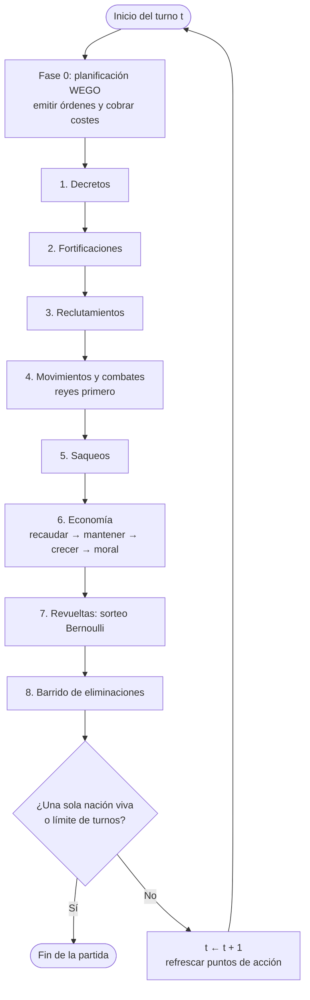
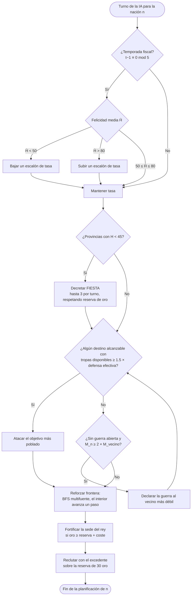

# Parcial II — Modelo Lógico-Matemático del sistema *Age of Conquest*

> **Plantilla de trabajo.** Cada sección lleva el id de requisito de `spec.yaml`.
> Los bloques `<!-- TODO … -->` marcan lo que hay que rellenar; bórralos al terminar.
> Regla transversal: ningún símbolo puede aparecer en las secciones 2–4 sin estar
> declarado en la tabla de la sección 1.

**Asignatura:** Simulación de Sistemas — UNET
**Equipo:** <!-- TODO: integrantes -->
**Fecha:** <!-- TODO -->
**Sistema modelado:** Age of Conquest IV
**Fase:** Transición del modelo conceptual (Parcial I) al diseño lógico y matemático

---

## 0. Alcance y convenciones de notación

<!-- TODO: 1 párrafo. Qué subsistemas cubre el modelo (mapa, economía, población,
     moral, combate, diplomacia, IA) y qué queda fuera del alcance. -->

**Índices y conjuntos**

| Símbolo | Significado | Dominio |
|---|---|---|
| $t$ | turno (reloj discreto de la simulación) | $t \in \mathbb{N},\ t \ge 1$ |
| $i$ | provincia | $i \in \mathcal{P}$ |
| $n$ | nación | $n \in \mathcal{N}$ |
| $\mathcal{P}_n$ | provincias controladas por la nación $n$ | $\mathcal{P}_n \subseteq \mathcal{P}$ |
| $\mathcal{N}^{vivas}$ | naciones no eliminadas | $\subseteq \mathcal{N}$ |

**Convenciones**

- $\mathbb{1}[\,\cdot\,]$ es la función indicadora (1 si la condición se cumple, 0 si no).
- $\lceil x \rceil$ techo, $\lfloor x \rfloor$ suelo, $\mathrm{clamp}(x,a,b) = \min(\max(x,a),b)$.
- Los subíndices $t$ denotan el valor **al inicio** del turno $t$, antes de resolverlo.

---

## 1. Diccionario Formal de Variables y Parámetros

<!-- Cubre E1.R1, E1.R2, E1.R3 — criterio "Coherencia Sistémica" (15%) -->

### 1.1 Variables de Estado *(E1.R1)*

> Definen la configuración del sistema en el instante $t$; persisten entre turnos.
> Cada una debe tener su ecuación de actualización en la sección 2.

| Símbolo | Nombre | Unidad | Dominio | Ecuación que la actualiza |
|---|---|---|---|---|
| $P_{i,t}$ | población de la provincia | habitantes | $[0,\ 10^6]$ | §2.2 |
| $T_{i,t}$ | guarnición | soldados | $\mathbb{Z}_{\ge 0}$ | §2.4 |
| $H_{i,t}$ | felicidad / moral | puntos de moral | $[0, 100]$ | §2.3 |
| $F_{i,t}$ | fortificación | adimensional (binaria) | $\{0,1\}$ | §3.1 fase 2 |
| $O_{i,t}$ | dueño de la provincia | identificador | $\mathcal{N} \cup \{\varnothing\}$ | §2.4, §2.5 |
| $E_{n,t}$ | tesoro | oro | $\mathbb{R}$ <!-- TODO: ¿acotado por abajo? ver §4.1 --> | §2.1 |
| $A_{n,t}$ | puntos de acción | AP | $\mathbb{R}_{\ge 0}$ | §3.1 fase 10 |
| $\tau_{n,t}$ | tasa impositiva | % | $\{0,50,100,150,200\}$ | §3.1 fase 0 |
| $k_{n,t}$ | sede del rey | identificador | $\mathcal{P} \cup \{\varnothing\}$ | §2.4, §4.2 |
| $D_{n,m,t}$ | estado diplomático | categórica | {NEUTRAL, GUERRA, ALIANZA} | §3.2 |
| $X_{n,t}$ | nación eliminada | adimensional (binaria) | $\{0,1\}$ | §3.1 fase 8 |
| $t$ | reloj de la simulación | turnos | $\mathbb{N}$ | §3.3 |

<!-- TODO: añadir filas si el modelo del equipo incorpora más estado
     (p. ej. tropas embarcadas, tratados con vigencia, etc.) -->

### 1.2 Variables de Flujo *(E1.R1, E1.R2)*

> Tasas de cambio: transforman el estado entre $t$ y $t+1$. **Unidad por turno.**

| Símbolo | Nombre | Unidad | Definición | Sección |
|---|---|---|---|---|
| $I_{n,t}$ | recaudación de impuestos | oro/turno | | §2.1 |
| $G_{n,t}$ | gasto total (militar + administrativo) | oro/turno | | §2.1 |
| $\Delta P_{i,t}$ | variación de población | habitantes/turno | | §2.2 |
| $\Delta H_{n,t}$ | variación de felicidad | puntos/turno | | §2.3 |
| $R_{i,t}$ | reclutamiento | soldados/turno | | §2.2 |
| $B_{i,t}$ | bajas de combate | soldados/turno | | §2.4 |

<!-- TODO: completar columna "Definición" con la expresión de cada flujo -->

### 1.3 Variables Auxiliares *(E1.R1)*

> Derivadas; se calculan dentro del turno y no se almacenan entre turnos.

| Símbolo | Nombre | Unidad | Expresión |
|---|---|---|---|
| $F^{A}_{t}$ | fuerza efectiva del atacante | soldados equivalentes | $T_A\,(1+b_A)$ |
| $F^{D}_{t}$ | fuerza efectiva del defensor | soldados equivalentes | $T_D\,(1+b_D)$ |
| $d_{i,t}$ | descontento | puntos de moral | $\max(0,\ H^{*} - H_{i,t})$ |
| $q_{i,t}$ | probabilidad de revuelta | adimensional $[0,1]$ | §2.5 |
| $M_{n,t}$ | efectivos militares totales | soldados | $\sum_{i \in \mathcal{P}_n} T_{i,t}$ |
| $\bar{H}_{n,t}$ | felicidad media de la nación | puntos de moral | $\frac{1}{|\mathcal{P}_n|}\sum_{i \in \mathcal{P}_n} H_{i,t}$ |

<!-- TODO: añadir las auxiliares que use la IA en §3.2 (defensa efectiva,
     distancia a la frontera, etc.) -->

### 1.4 Parámetros Fijos *(E1.R3)*

> **Procedencia:** `[D]` documentado en el juego real · `[M]` decisión de modelado
> propia · `[C]` calibrado por experimento.

**Combate**

| Símbolo | Parámetro | Valor | Unidad | Proc. |
|---|---|---|---|---|
| $b_K$ | bono de combate del rey | 0.30 | adimensional | [D] |
| $b_F$ | bono defensivo de fortificación | 0.50 | adimensional | [D] |
| $\varphi$ | factor de desgaste del ganador | 0.70 | adimensional | [M][C] |

**Economía**

| Símbolo | Parámetro | Valor | Unidad | Proc. |
|---|---|---|---|---|
| $G_{max}$ | renta máxima por provincia | 250 | oro/(provincia·turno) | [D] |
| $P_{max}$ | población máxima por provincia | $10^6$ | habitantes | [D] |
| $u$ | soldados mantenidos por 1 oro | 20 | soldados/oro | [D] |
| $a$ | coste administrativo | 1 | oro/(provincia·turno) | [M] |
| — | tasas permitidas | {0,50,100,150,200} | % | [D] |
| $N_\tau$ | intervalo de temporada fiscal | 5 | turnos | [M] |

**Población y moral**

| Símbolo | Parámetro | Valor | Unidad | Proc. |
|---|---|---|---|---|
| $g$ | tasa de crecimiento poblacional | 0.015 | 1/turno | [M][C] |
| $h_0$ | recuperación base de felicidad | 1.0 | puntos/turno | [M] |
| $\beta$ | sensibilidad de la moral a la tasa | 0.04 | puntos/(turno·%) | [M][C] |
| $w$ | penalización de moral por guerra | 2.0 | puntos/turno | [M] |
| $H^{*}$ | umbral fiscal y de revuelta | 50 | puntos de moral | [M][C] |

**Revueltas**

| Símbolo | Parámetro | Valor | Unidad | Proc. |
|---|---|---|---|---|
| $\kappa$ | constante de riesgo de revuelta | $4\times10^{-4}$ | 1/puntos² | [M][C] |
| $q_{max}$ | probabilidad máxima de revuelta | 0.9 | adimensional | [M] |
| $\sigma$ | supresión por guarnición | 0.5 | adimensional | [M] |
| $\rho$ | milicia rebelde por habitante | $2\times10^{-4}$ | soldados/habitante | [M] |
| $s$ | semilla del generador aleatorio | 20260705 | — | [M] |

**Órdenes y acciones**

<!-- TODO: tabla de costes en AP y oro de mover / reclutar / fortificar /
     declarar guerra / saquear / decretos. Fuente: src/model/Rules.java:48-137 -->

**Reglas de partida**

| Símbolo | Parámetro | Valor | Unidad | Proc. |
|---|---|---|---|---|
| $\lambda$ | territorio perdido al morir el rey | 0.9 | fracción | [D] |
| $A_0$ | puntos de acción base | 3.0 | AP/turno | [M] |
| $A_1$ | AP adicionales por provincia | 0.5 | AP/(provincia·turno) | [M] |

---

## 2. Formulación del Modelo Matemático

<!-- Criterio "Rigor Matemático" (35%) -->

### 2.1 Dinámica económica: el tesoro *(E2.R1)*

**Recaudación.** Una provincia solo tributa si su moral alcanza el umbral:

$$
I_{n,t} \;=\; \sum_{i \in \mathcal{P}_n} \mathbb{1}\!\left[H_{i,t} \ge H^{*}\right]\; G_{max}\,\frac{P_{i,t}}{P_{max}}\,\frac{\tau_{n,t}}{100}
$$

**Gasto.** Mantenimiento militar (redondeo al alza) más administración territorial:

$$
G_{n,t} \;=\; \left\lceil \frac{M_{n,t}}{u} \right\rceil \;+\; a\,\left|\mathcal{P}_n\right|
$$

**Ecuación de estado del tesoro:**

$$
E_{n,t+1} \;=\; E_{n,t} \;+\; I_{n,t} \;-\; G_{n,t} \;-\; C_{n,t}
$$

donde $C_{n,t}$ es el gasto discrecional en órdenes emitidas durante la fase de
planificación (reclutamiento, fortificaciones, decretos), cobrado en el momento
de emitir la orden.

<!-- TODO: (a) justificar por qué el mantenimiento usa techo y no proporción
     continua; (b) desarrollar C_{n,t} como suma de los costes de la tabla de
     §1.4; (c) discutir el punto de equilibrio fiscal: ¿qué relación
     tropas/provincias hace I = G? -->

**Balance dimensional:** <!-- TODO: [oro] = [oro] + [oro/turno]·[turno] − … -->

### 2.2 Dinámica poblacional *(E2.R2)*

$$
P_{i,t+1} \;=\; \min\!\Big(P_{max},\; \mathrm{round}\big(P_{i,t}\,(1+g)\big)\Big) \;-\; c_R\,R_{i,t} \;-\; \Delta P^{saq}_{i,t} \;+\; \Delta P^{fest}_{i,t}
$$

con $c_R = 2$ habitantes por soldado reclutado,
$\Delta P^{saq}_{i,t} = 0.20\,P_{i,t}\,\mathbb{1}[\text{saqueada}]$ y
$\Delta P^{fest}_{i,t} = 0.20\,P_{i,t}\,\mathbb{1}[\text{festival}]$.

<!-- TODO: (a) declarar EN QUÉ ORDEN se aplican los términos dentro del turno —
     el reclutamiento descuenta en la fase de planificación, el crecimiento en la
     fase económica; (b) caracterizar la trayectoria: geométrica truncada, tiempo
     hasta saturación desde P_0 dado g = 1.5%. -->

### 2.3 Dinámica de la moral *(E2.R3)*

$$
\Delta H_{n,t} \;=\; h_0 \;+\; (100 - \tau_{n,t})\,\beta \;-\; w\,\mathbb{1}\!\left[\exists m: D_{n,m,t} = \text{GUERRA}\right]
$$

$$
H_{i,t+1} \;=\; \mathrm{clamp}\Big(H_{i,t} + \Delta H_{n,t} + \textstyle\sum_j \delta^{decreto}_{j} - 30\,\mathbb{1}[\text{saqueada}],\; 0,\; 100\Big)
$$

con $\delta^{REPARTIR} = +10$, $\delta^{FIESTA} = +20$.

**Punto fijo.** $\Delta H_{n,t} = 0$ cuando

$$
\tau^{eq} \;=\; 100 + \frac{h_0 - w\,\mathbb{1}[\text{guerra}]}{\beta}
$$

<!-- TODO: evaluar τ_eq en paz (= 125) y en guerra (= 75) e interpretar: en
     guerra, cualquier tasa ≥ 100 hace decaer la moral hasta cruzar H* y
     desactivar la recaudación. Este es el lazo de realimentación central del
     modelo; conviene un párrafo y, si se puede, una gráfica de trayectoria. -->

### 2.4 Modelo de resolución de combate *(E2.R4)*

**Fuerzas efectivas.**

$$
F^{A} = T_A\,(1 + b_K\,\mathbb{1}[\text{el rey ataca}]) \qquad
F^{D} = T_D\,(1 + b_F\,F_{i,t} + b_K\,\mathbb{1}[\text{el rey defiende}])
$$

**Criterio de victoria.**

$$
\text{vence el atacante} \iff F^{A} > F^{D}
\qquad\text{(el empate exacto lo retiene el defensor)}
$$

**Supervivientes del bando vencedor.**

$$
S \;=\; \max\!\left(1,\; \mathrm{round}\!\left[\,T_{gan}\left(1 - \varphi\,\frac{F^{perd}}{F^{gan}}\right)\right]\right)
$$

El bando derrotado se destruye por completo: $B_{perd} = T_{perd}$.
Caso degenerado $T_D = 0$: ocupación sin bajas, $S = T_A$.

**Relación con Lanchester.**

<!-- TODO: párrafo obligatorio. La ley cuadrática de Lanchester es un sistema de
     EDO continuo dA/dt = −βD, dD/dt = −αA con invariante α A² − β D² = cte.
     Aquí se resuelve la batalla en un único paso discreto. Argumentar:
       (a) por qué el turno WEGO justifica la forma de una sola pasada;
       (b) que las bajas del ganador dependen solo del COCIENTE de fuerzas, no
           del tamaño absoluto (comprobarlo con dos ejemplos numéricos);
       (c) qué se pierde respecto al modelo continuo y por qué es aceptable. -->

**Ejemplos numéricos de verificación:**

| Caso | $T_A$ | $b_A$ | $T_D$ | $b_D$ | $F^A$ | $F^D$ | Vencedor | $S$ |
|---|---|---|---|---|---|---|---|---|
| Ataque limpio | 100 | 0 | 40 | 0 | | | | |
| Contra fortificación | 100 | 0 | 60 | 0.50 | | | | |
| Rey vs rey fortificado | 100 | 0.30 | 60 | 0.80 | | | | |
| Provincia vacía | 30 | 0 | 0 | — | | | | |

<!-- TODO: completar la tabla; sirve de banco de pruebas para el Parcial III -->

### 2.5 Generación de variables aleatorias y revueltas *(E2.R5)*

**Única fuente de estocasticidad del modelo.** El resto del sistema (combate,
economía, decisiones de la IA) es determinista.

**Ley de probabilidad.** Para cada provincia con $H_{i,t} < H^{*}$:

$$
d_{i,t} = H^{*} - H_{i,t}, \qquad
q_{i,t} \;=\; \min\!\big(q_{max},\; \kappa\,d_{i,t}^{2}\big)\;\cdot\;\sigma^{\,\mathbb{1}[T_{i,t}\ge 1]}
$$

**Generación.** Se sortea $U \sim \mathrm{Uniforme}(0,1)$ y se aplica transformada
inversa sobre la Bernoulli:

$$
Z_{i,t} = \mathbb{1}[\,U < q_{i,t}\,] \sim \mathrm{Bernoulli}(q_{i,t})
$$

**Generador de $U(0,1)$.** Congruencial lineal de 48 bits:

$$
X_{k+1} = (a\,X_k + c) \bmod m, \qquad U_k = X_{k+1} / m
$$

<!-- TODO: (a) dar los valores a, c, m del LCG usado (java.util.Random:
     a = 25214903917, c = 11, m = 2^48) y su periodo;
     (b) justificar la semilla fija s = 20260705 → reproducibilidad;
     (c) explicar el uso de SEMILLAS APAREADAS entre variantes experimentales
         como técnica de reducción de varianza (ya empleada en BatchRunner);
     (d) opcional: comentar limitaciones del LCG (correlación serial en
         dimensiones altas) y por qué son irrelevantes a esta escala. -->

**Efecto de la revuelta triunfante** ($Z_{i,t}=1$):

$$
O_{i,t+1} \leftarrow \varnothing, \qquad
T_{i,t+1} \leftarrow \max(1,\ \mathrm{round}(\rho\,P_{i,t})), \qquad
F_{i,t+1} \leftarrow 0, \qquad
H_{i,t+1} \leftarrow 60
$$

y si $k_{n,t} = i$, el rey huye a la provincia propia con mayor guarnición.

### 2.6 Verificación del balance dimensional *(E2.R6)*

| Ecuación | Término izquierdo | Términos derechos | ¿Balanceada? |
|---|---|---|---|
| §2.1 tesoro | [oro] | [oro] + [oro/turno]·[turno] | |
| §2.2 población | [hab] | [hab] + [hab] | |
| §2.3 moral | [puntos] | [puntos] + [puntos/turno]·[turno] | |
| §2.4 combate | [soldados] | [soldados]·[adimensional] | |
| §2.5 revuelta | [adimensional] | [1/puntos²]·[puntos²] | |

<!-- TODO: completar y rematar con una frase de veredicto -->

---

## 3. Diseño Algorítmico y Lógica de Decisión

<!-- Criterio "Lógica Algorítmica" (35%) -->

### 3.1 Ciclo de resolución de fin de turno *(E3.R1)*

**Pseudocódigo.**

```
PROCEDIMIENTO ResolverTurno(estado, t)

  # ---- Fase 0: planificación (WEGO, simultánea) --------------------------
  PARA CADA nación n en N_vivas:
      órdenes[n] ← recolectar órdenes (jugador humano o política de IA §3.2)
      PARA CADA orden o en órdenes[n]:
          SI validar(o) Y A[n] ≥ costeAP(o) Y E[n] ≥ costeOro(o):
              A[n] ← A[n] − costeAP(o)          # los costes se cobran AL EMITIR
              E[n] ← E[n] − costeOro(o)
              encolar(o)
          SI NO:
              rechazar(o) con mensaje

  # ---- Fases de resolución ------------------------------------------------
  1. Decretos           # REPARTIR (+10 H), FIESTA (+20 H), FESTIVAL (+20% P)
  2. Fortificaciones    # F ← 1
  3. Reclutamientos     # T ← T + soldados
  4. Movimientos y combates
        ordenar movimientos: primero los que llevan al rey, luego por orden de emisión
        PARA CADA movimiento:
            revalidar origen, tropas disponibles y estado de guerra
            SI destino propio  → trasladar tropas
            SI NO              → ResolverCombate(§2.4)
  5. Saqueos
  6. Economía           # recaudación → mantenimiento → crecimiento P → ΔH
  7. Revueltas          # fase estocástica §2.5
  8. Barrido de eliminaciones
  9. Comprobación de victoria
 10. SI la partida no ha terminado:
        t ← t + 1
        PARA CADA nación n: A[n] ← A_0 + A_1·|P_n|      # refresco de AP

FIN PROCEDIMIENTO
```

**Diagrama de flujo.**



**Justificación del orden de cálculo.**

<!-- TODO: OBLIGATORIO. Explicar por qué:
     (a) los costes se cobran al emitir y no al resolver (impide gastar dos
         veces el mismo oro en un turno simultáneo);
     (b) la recaudación precede al crecimiento poblacional — el enunciado
         sugiere el orden inverso: hay que argumentar que el censo fiscal se
         levanta al inicio del turno, y cuantificar la diferencia (≈1.5% de
         renta por turno);
     (c) las revueltas van DESPUÉS de la economía: la moral del turno ya
         actualizada es la que determina el riesgo;
     (d) los reyes mueven primero. -->

### 3.2 Árbol de decisión de la IA *(E3.R2)*

**Política determinista.** Todos los umbrales son parámetros nombrados
(§1.4/§3.2) y calibrables.



**Defensa efectiva usada por el criterio de ataque:**

$$
\hat{F}^{D}_{i} \;=\; \max(1,\ T_{i,t})\,\big(1 + b_F F_{i,t} + b_K\,\mathbb{1}[k_{m,t}=i]\big)
$$

**Umbrales de la política**

| Símbolo | Parámetro | Valor |
|---|---|---|
| $\alpha$ | ventaja mínima para atacar | 1.5 |
| $\theta_{res}$ | reserva de oro intocable | 30 |
| $\theta_{fiesta}$ | felicidad bajo la cual se decreta fiesta | 45 |
| $\theta_{baja}$ / $\theta_{sube}$ | umbrales de ajuste fiscal | 50 / 80 |
| $\gamma$ | superioridad total para declarar guerra | 2.0 |
| — | guarnición mínima que nunca se mueve | 1 soldado |

<!-- TODO: (a) añadir pseudocódigo del BFS de refuerzo de frontera;
     (b) comentar por qué la política es determinista y qué implica para el
         diseño de experimentos (aísla la aleatoriedad en las revueltas). -->

### 3.3 Lista de Eventos Futuros y reloj de la simulación *(E3.R3)*

> ⚠ **Sección crítica.** El motor implementado avanza por **incremento fijo de
> tiempo** (turnos), no por cola de eventos. Antes de redactar, decidir el enfoque:
> **A)** documentar la equivalencia formal entre fases de turno y eventos
> programados con prioridad; **B)** especificar (y luego implementar) una LEF real.
> Ver `spec.yaml → E3.R3.salidas_posibles`. Rellenar según la opción elegida.

**Estructura del registro de evento.**

| Campo | Tipo | Descripción |
|---|---|---|
| `tiempo` | entero (turno) | instante de ocurrencia |
| `prioridad` | entero | orden dentro del mismo instante (fase) |
| `tipo` | enumerado | ver catálogo |
| `entidad` | id | provincia o nación afectada |
| `payload` | registro | parámetros del evento |
| `secuencia` | entero | orden de emisión, desempate final |

**Relación de orden de la LEF:**

$$
e_1 \prec e_2 \iff (\text{tiempo}_1, \text{prioridad}_1, \text{secuencia}_1) <_{lex} (\text{tiempo}_2, \text{prioridad}_2, \text{secuencia}_2)
$$

**Catálogo de eventos**

| Tipo | Prioridad | Naturaleza | Programación |
|---|---|---|---|
| DECRETO | 1 | condicional | al emitir la orden, para el turno $t$ |
| FORTIFICAR | 2 | condicional | al emitir la orden |
| RECLUTAR | 3 | condicional | al emitir la orden |
| MOVER / COMBATE | 4 | condicional | al emitir la orden (reyes con prioridad 4.0, resto 4.1) |
| SAQUEO | 5 | condicional | al emitir la orden |
| ECONOMÍA | 6 | periódico | cada turno |
| SORTEO_REVUELTA | 7 | periódico | cada turno, por provincia con $H < H^{*}$ |
| ELIMINACION | 8 | condicional | disparado por combate o revuelta |
| VICTORIA | 9 | condicional | evaluado al cierre de turno |
| FIN_DE_TURNO | 10 | periódico | cada turno; reprograma el ciclo |
| TEMPORADA_FISCAL | 0 | periódico | turnos $1, 1+N_\tau, 1+2N_\tau, \dots$ |

**Bucle principal del reloj.**

```
PROCEDIMIENTO BucleDeSimulación(estado_inicial, condición_de_parada)
    reloj ← 1
    LEF ← cola de prioridad vacía, ordenada por (tiempo, prioridad, secuencia)
    programar los eventos periódicos iniciales del turno 1

    MIENTRAS LEF no esté vacía Y NO condición_de_parada(estado):
        e ← extraer_mínimo(LEF)
        reloj ← e.tiempo                      # el reloj SALTA al evento, nunca retrocede
        estado ← ejecutar(e, estado)
        PARA CADA evento hijo h generado por e:
            programar(h) en LEF               # h.tiempo ≥ reloj (no hay eventos al pasado)

    devolver estado, reloj, estadísticas
FIN PROCEDIMIENTO
```

<!-- TODO según la opción elegida:
     Opción A — argumentar la equivalencia: con turnos de duración fija y fases
       de prioridad fija, la cola de prioridad se reduce a un recorrido
       secuencial determinista; demostrar que el orden extraído coincide con la
       secuencia de §3.1 y que ningún evento se programa a tiempo pasado.
       Señalar cuáles son los eventos genuinamente diferidos del modelo
       (TEMPORADA_FISCAL cada 5 turnos) y cuáles condicionales.
     Opción B — especificar la estructura de datos concreta (montículo binario,
       coste O(log k) por operación), la política de cancelación de eventos
       cuyo sujeto desaparece (provincia conquistada antes de su saqueo:
       ver el chequeo de dueño en la fase 5) y el mecanismo de reproducibilidad. -->

**Condiciones de parada.**

$$
\text{fin} \iff \left|\mathcal{N}^{vivas}\right| = 1 \;\;\lor\;\; \big(t_{max} > 0 \;\land\; t \ge t_{max}\big)
$$

En el segundo caso vence la nación con más provincias, desempatando por efectivos
militares totales.

---

## 4. Condiciones de Frontera y Puntos Críticos

<!-- Criterio "Tratamiento de Fronteras" (15%) -->

### 4.1 Límites del sistema *(E4.R1)*

| Variable | Dominio | Frontera inferior: qué ocurre | Frontera superior: qué ocurre |
|---|---|---|---|
| $H_{i,t}$ | $[0,100]$ | $H=0$: riesgo de revuelta saturado en $q_{max}$ | $H=100$: saturación, sin beneficio adicional |
| $P_{i,t}$ | $[0, P_{max}]$ | $P=0$: sin renta ni reclutamiento posible | $P=P_{max}$: crecimiento detenido, renta máxima |
| $T_{i,t}$ | $\mathbb{Z}_{\ge0}$ | $T=0$: provincia ocupable sin bajas | — |
| $A_{n,t}$ | $\mathbb{R}_{\ge0}$ | $A < $ coste: orden rechazada | refrescado cada turno |
| $E_{n,t}$ | <!-- TODO --> | <!-- TODO: ¡HUECO! ver abajo --> | — |
| $\|\mathcal{P}_n\|$ | $\mathbb{Z}_{\ge0}$ | $=0$: nación eliminada | — |
| $k_{n,t}$ | $\mathcal{P}\cup\{\varnothing\}$ | $=\varnothing$: rey muerto → §4.2 | — |

> **HUECO A RESOLVER — insolvencia.** El enunciado pregunta explícitamente qué
> ocurre "cuando el déficit económico supera las reservas". En el modelo actual
> $E_{n,t}$ puede ser negativo sin ninguna consecuencia mecánica. Hay que definir
> la regla, por ejemplo:
>
> $$
> E_{n,t+1} < 0 \;\Rightarrow\; T_{i,t+1} \leftarrow \big\lfloor T_{i,t}\,(1-\delta) \big\rfloor \ \ \forall i \in \mathcal{P}_n,
> \quad \delta = \min\!\left(1, \frac{|E_{n,t+1}|}{G^{mil}_{n,t}}\right)
> $$
>
> (deserción proporcional al impago hasta reequilibrar el mantenimiento), y
> $E_{n,t+1} \leftarrow 0$ tras la deserción.
>
> <!-- TODO: decidir la regla, justificarla y verificar que no genera oscilación
>      (deserción → menos mantenimiento → superávit → recluta → deserción…). -->

### 4.2 Funciones por partes *(E4.R2)*

**(a) Umbral fiscal de la moral** — discontinuidad de salto en la renta:

$$
\text{Renta}(i,t) =
\begin{cases}
G_{max}\dfrac{P_{i,t}}{P_{max}}\dfrac{\tau_{n,t}}{100}, & H_{i,t} \ge H^{*} \\[2mm]
0, & H_{i,t} < H^{*}
\end{cases}
$$

<!-- TODO: describir el lazo de realimentación positiva que abre esta
     discontinuidad: H < 50 → renta 0 → sin oro para decretos → H sigue cayendo
     → revuelta. Es el punto crítico principal del modelo; conviene señalar la
     única salida (bajar la tasa en la siguiente temporada fiscal) y el retardo
     de hasta 5 turnos que impone §3.3. -->

**(b) Muerte del rey** — colapso territorial:

$$
\left|\mathcal{P}_n\right|^{+} =
\begin{cases}
\max\big(1,\ \lfloor |\mathcal{P}_n|\,(1-\lambda) \rfloor\big), & \lambda < 1 \\[2mm]
0 \;\Rightarrow\; \text{nación eliminada}, & \lambda = 1
\end{cases}
$$

Se conservan las provincias con mayor guarnición; las restantes pasan a neutral
**conservando su guarnición**.

**(c) Resultado de combate** — función escalón sobre $F^{A}-F^{D}$:

$$
\text{Resultado} =
\begin{cases}
\text{conquista}, & F^{A} > F^{D} \\
\text{defensa}, & F^{A} \le F^{D}
\end{cases}
$$

<!-- TODO: señalar que es una bifurcación total — un soldado de diferencia
     invierte el resultado — y discutir si eso es deseable o si convendría una
     versión probabilística (p. ej. P(victoria) = F_A/(F_A+F_D)). -->

**(d) Saturación del riesgo de revuelta:**

$$
q_{i,t} =
\begin{cases}
\kappa\,d_{i,t}^{2}, & \kappa\,d_{i,t}^{2} < q_{max} \\
q_{max}, & \kappa\,d_{i,t}^{2} \ge q_{max}
\end{cases}
$$

<!-- TODO: calcular el punto de saturación: d = √(q_max/κ) = √2250 ≈ 47.4, es
     decir H ≈ 2.6. Interpretar: por debajo de esa moral no hay penalización
     marginal adicional. -->

**(e) Temporada fiscal** — controlabilidad intermitente:

$$
\tau_{n,t} \text{ modificable} \iff (t-1) \bmod N_\tau = 0
$$

**(f) Techo poblacional:**

$$
P_{i,t+1} = \min\big(P_{max},\ P_{i,t}(1+g)\big)
$$

---

## 5. Trazabilidad modelo ↔ implementación

<!-- Opcional pero muy rentable: demuestra que el documento es programable,
     que es literalmente lo que pide la nota final del enunciado. -->

| Sección | Ecuación / algoritmo | Archivo del clon |
|---|---|---|
| §2.1 | tesoro | `src/engine/TurnEngine.java` — `resolveEconomy` |
| §2.2 | población | `src/engine/TurnEngine.java` — `resolveEconomy`, `submitRecruit` |
| §2.3 | moral | `src/engine/TurnEngine.java` — `resolveEconomy` |
| §2.4 | combate | `src/engine/CombatResolver.java` — `resolve` |
| §2.5 | revueltas y aleatoriedad | `src/engine/TurnEngine.java` — `resolveRevolts` |
| §1.4 | parámetros | `src/model/Rules.java` |
| §3.1 | ciclo de turno | `src/engine/TurnEngine.java` — `endTurn` |
| §3.2 | IA | `src/ai/GreedyAgent.java` — `plan` |
| §3.3 | reloj | `src/model/GameState.java` — `advanceTurn` |
| §4 | fronteras | `src/model/Province.java`, `src/model/Nation.java` |

---

## Anexos sugeridos

- **A.** Escenario de referencia (Europa Antigua: 23 provincias, 4 naciones) con
  el estado inicial completo — permite reproducir cualquier cálculo del documento.
- **B.** Traza numérica de un turno completo, variable a variable.
- **C.** Resultados de sensibilidad ya disponibles (100 partidas por variante):
  efecto de $b_F$, $\varphi$ y $\kappa$ sobre duración y ganador de la partida.

<!-- TODO: decidir qué anexos se incluyen -->
